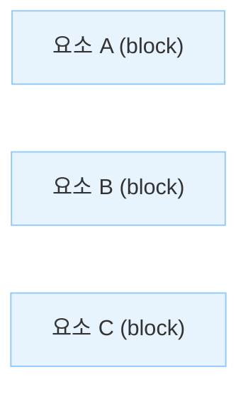
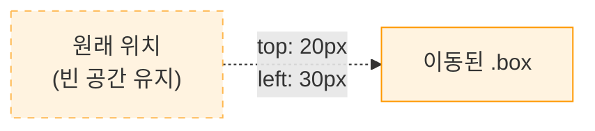
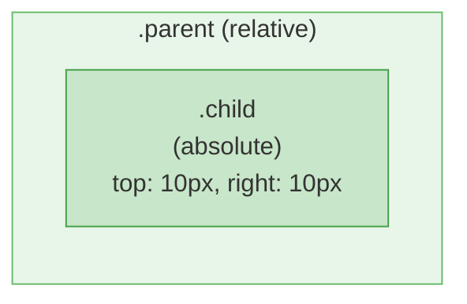
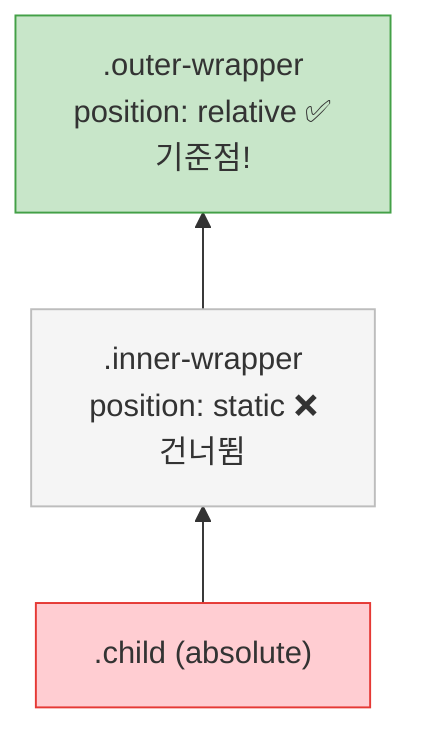
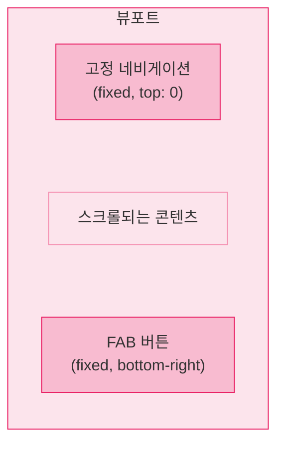
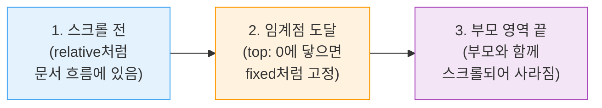
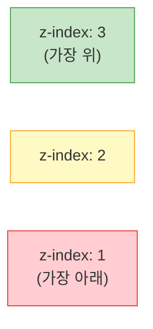
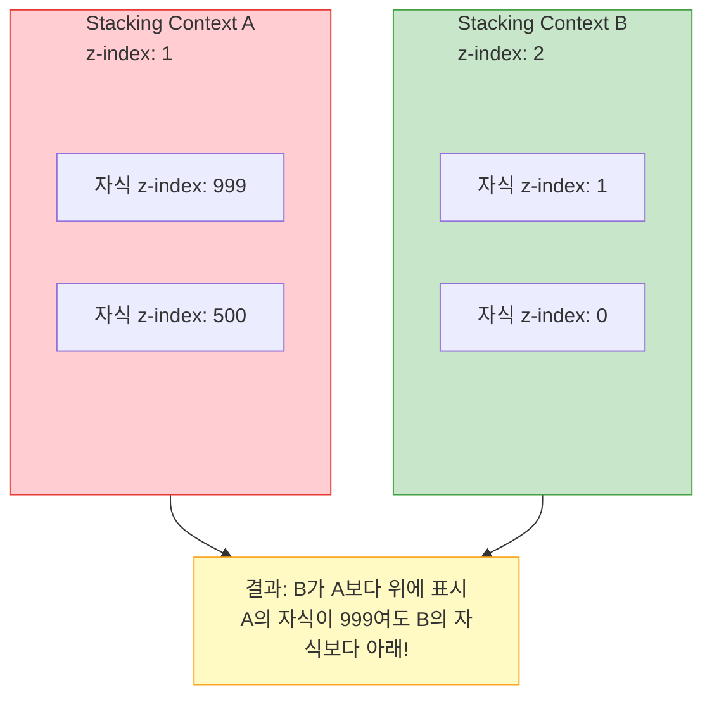

> 이 글은 주니어 개발자가 학습하며 정리한 내용입니다. 잘못된 정보가 있을 수 있으니, 발견하시면 편하게 알려주세요.

## Position이란

`position` 속성은 요소가 문서 내에서 **어떤 방식으로 배치될지** 결정하는 속성이다. 기본적으로 모든 요소는 **문서 흐름**, Normal Flow에 따라 순서대로 배치되는데, `position`을 변경하면 요소를 문서 흐름에서 벗어나게 하거나 기준점을 바꿔 원하는 위치에 배치할 수 있다.

위치 조정에는 `top`, `right`, `bottom`, `left` 속성을 함께 사용한다.

```css
.box {
  position: relative; /* 배치 방식 지정 */
  top: 10px; /* 기준점에서 아래로 10px */
  left: 20px; /* 기준점에서 오른쪽으로 20px */
}
```

### position 값 한눈에 보기

| 값         | 문서 흐름          | 기준점                      | 스크롤 시                   |
| ---------- | ------------------ | --------------------------- | --------------------------- |
| `static`   | 유지               | 없음 (offset 무시)          | 함께 스크롤                 |
| `relative` | 유지               | 자기 자신의 원래 위치       | 함께 스크롤                 |
| `absolute` | 이탈               | 가장 가까운 positioned 조상 | 함께 스크롤                 |
| `fixed`    | 이탈               | 뷰포트 (브라우저 창)        | 고정 (스크롤해도 안 움직임) |
| `sticky`   | 유지 → 조건부 고정 | 스크롤 컨테이너             | 임계점까지 스크롤 → 고정    |

> **positioned 요소란?**
>
> `position` 값이 `static`이 아닌 요소를 **positioned 요소**라고 부른다. 즉 `relative`, `absolute`, `fixed`, `sticky`가 적용된 요소를 말한다. `z-index`는 positioned 요소에서만 동작한다.

## static

모든 요소의 기본 `position` 값이다. **문서 흐름**, Normal Flow에 따라 순서대로 배치되며, `top`, `right`, `bottom`, `left`, `z-index` 속성이 모두 **무시**된다.

```css
div {
  position: static; /* 기본값 — 명시할 필요 없음 */
  top: 50px; /* 무시됨 */
  left: 100px; /* 무시됨 */
  z-index: 10; /* 무시됨 */
}
```



블록 요소는 위에서 아래로 순서대로 쌓인다. 이것이 Normal Flow의 기본 동작이다.

## relative

**원래 위치**, Normal Flow 상의 위치를 기준으로 이동한다. 핵심은 이동해도 **원래 자리의 공간은 그대로 유지**된다는 점이다. 다른 요소는 이 요소가 움직이지 않은 것처럼 배치된다.

```css
.box {
  position: relative;
  top: 20px; /* 원래 위치에서 아래로 20px */
  left: 30px; /* 원래 위치에서 오른쪽으로 30px */
}
```



### relative의 주요 용도

```css
/* 1. 미세한 위치 조정 */
.icon {
  position: relative;
  top: 2px; /* 아이콘을 살짝 아래로 정렬 */
}

/* 2. absolute 자식의 기준점 역할 (가장 흔한 용도) */
.parent {
  position: relative; /* 자식 absolute의 기준이 됨 */
}

.parent .child {
  position: absolute;
  top: 0;
  right: 0;
}
```

## absolute

**문서 흐름에서 완전히 이탈**한다. 원래 자리의 공간이 사라지며, 다른 요소들은 이 요소가 없는 것처럼 배치된다. **가장 가까운 positioned 조상**을 기준으로 배치되며, positioned 조상이 없으면 `<html>`을 기준으로 한다. 블록 요소여도 `width`가 콘텐츠 크기로 줄어든다(shrink-to-fit).

```css
.parent {
  position: relative; /* 기준점 역할 */
  width: 400px;
  height: 300px;
}

.child {
  position: absolute;
  top: 10px; /* 부모 상단에서 10px 아래 */
  right: 10px; /* 부모 우측에서 10px 안쪽 */
  width: 100px;
  height: 50px;
}
```



### positioned 조상 탐색 순서

absolute 요소는 기준점을 찾기 위해 DOM 트리를 위로 올라가며 positioned 조상을 탐색한다.



모든 조상이 `static`이면 최종적으로 `<html>` (초기 컨테이닝 블록)이 기준이 된다.

### absolute 활용 패턴

```css
/* 1. 부모 내부 특정 위치에 배치 */
.card {
  position: relative;
}

.card .badge {
  position: absolute;
  top: -8px;
  right: -8px; /* 부모 바깥으로 삐져나오게 */
}

/* 2. 부모 전체를 덮는 오버레이 */
.overlay {
  position: absolute;
  inset: 0; /* top: 0; right: 0; bottom: 0; left: 0; */
  background-color: rgba(0, 0, 0, 0.5);
}

/* 3. 가운데 정렬 */
.centered {
  position: absolute;
  top: 50%;
  left: 50%;
  transform: translate(-50%, -50%);
}
```

## fixed

**문서 흐름에서 완전히 이탈**하며 **뷰포트**, 브라우저 창을 기준으로 배치된다. **스크롤해도 화면의 같은 위치에 고정**되어 있는 것이 absolute와의 핵심 차이다. absolute와 마찬가지로 블록 요소의 `width`가 콘텐츠 크기로 줄어든다.

```css
/* 상단 고정 네비게이션 바 */
.navbar {
  position: fixed;
  top: 0;
  left: 0;
  right: 0;
  height: 60px;
  background: white;
  z-index: 100;
}

/* fixed 요소 아래 콘텐츠가 가려지므로 여백 필요 */
body {
  padding-top: 60px; /* navbar 높이만큼 밀어줌 */
}
```



### fixed 활용 패턴

```css
/* 1. 상단 고정 헤더 */
.header {
  position: fixed;
  top: 0;
  left: 0;
  right: 0;
  z-index: 1000;
}

/* 2. 플로팅 버튼 (FAB) */
.fab {
  position: fixed;
  bottom: 20px;
  right: 20px;
  width: 56px;
  height: 56px;
  border-radius: 50%;
}

/* 3. 전체 화면 모달 오버레이 */
.modal-overlay {
  position: fixed;
  inset: 0;
  background: rgba(0, 0, 0, 0.5);
  z-index: 9999;
}
```

> **주의 — fixed와 transform**
>
> 조상 요소에 `transform`, `filter`, `perspective` 속성이 있으면 fixed가 뷰포트가 아닌 **그 조상을 기준으로 동작**하게 된다. 새로운 컨테이닝 블록이 생성되기 때문이다.
>
> ```css
> .parent {
>   transform: translateZ(0); /* 이것만으로도 fixed 동작이 바뀜! */
> }
>
> .parent .child {
>   position: fixed;
>   top: 0;
>   /* 뷰포트가 아닌 .parent를 기준으로 고정됨 */
> }
> ```

## sticky

`relative`와 `fixed`의 혼합이다. 평소에는 relative처럼 문서 흐름에 있다가, **스크롤이 지정한 임계점에 도달하면 fixed처럼 고정**된다. `top`, `right`, `bottom`, `left` 중 **최소 하나를 반드시 지정**해야 동작하며, **부모 요소의 영역을 벗어나면 고정이 해제**된다.

```css
.section-title {
  position: sticky;
  top: 0; /* 뷰포트 상단에 도달하면 고정 */
  background: white;
  z-index: 10;
}
```

### sticky 동작 과정



### sticky 활용 패턴

```css
/* 1. 테이블 헤더 고정 */
th {
  position: sticky;
  top: 0;
  background: white;
}

/* 2. 사이드바 내비게이션 */
.sidebar-nav {
  position: sticky;
  top: 80px; /* 헤더 높이만큼 아래에서 고정 */
}

/* 3. 연락처 앱 스타일 — 알파벳 그룹 헤더 */
.group-header {
  position: sticky;
  top: 0;
  background: #f0f0f0;
  padding: 8px 16px;
  font-weight: bold;
}
```

### sticky가 동작하지 않는 경우

| 원인                           | 설명                             | 해결                      |
| ------------------------------ | -------------------------------- | ------------------------- |
| `top`/`bottom` 미지정          | 임계점이 없으면 고정되지 않음    | `top: 0` 등을 반드시 지정 |
| 조상에 `overflow: hidden/auto` | 스크롤 컨테이너가 달라짐         | overflow 설정 확인/제거   |
| 부모 높이 = sticky 요소 높이   | 고정될 공간이 없음               | 부모에 충분한 높이 확보   |
| 부모가 `overflow` 스크롤 영역  | 뷰포트가 아닌 부모 기준으로 동작 | 스크롤 구조 재확인        |

## offset 속성 (top, right, bottom, left)

positioned 요소(`static` 제외)의 위치를 조정하는 속성이다. 기준점에서 얼마나 떨어질지를 지정한다.

- `top`과 `bottom`이 동시에 지정되면 `top`이 우선한다. (요소 높이가 미지정이면 늘어남)
- `left`와 `right`가 동시에 지정되면 `left`가 우선한다. (요소 너비가 미지정이면 늘어남)

```css
.box {
  position: absolute;
  top: 10px; /* 기준 상단에서 아래로 10px */
  right: 20px; /* 기준 우측에서 왼쪽으로 20px */
  bottom: 10px; /* 기준 하단에서 위로 10px */
  left: 20px; /* 기준 좌측에서 오른쪽으로 20px */
}
```

### inset (단축 속성)

`top`, `right`, `bottom`, `left`를 한 번에 지정하는 단축 속성이다. margin/padding과 동일하게 시계방향(상 → 우 → 하 → 좌) 순서이다.

```css
.box {
  inset: 0; /* 상하좌우 모두 0 */
  inset: 10px 20px; /* 상하 10px, 좌우 20px */
  inset: 10px 20px 30px 40px; /* 상 10px, 우 20px, 하 30px, 좌 40px */
}
```

## z-index

positioned 요소(`static` 제외)의 **앞뒤 겹침 순서**를 결정하는 속성이다. 값이 클수록 위(앞)에 표시되며, 같은 z-index라면 HTML에서 나중에 작성된 요소가 위에 표시된다.

```css
.box-a {
  position: relative;
  z-index: 1; /* 아래 */
}

.box-b {
  position: relative;
  z-index: 2; /* 위 (더 큰 값) */
}
```



### z-index 기본 규칙

```css
/* 1. z-index는 positioned 요소에서만 동작 */
.box {
  position: static;
  z-index: 999; /* 무시됨 — static이므로 */
}

.box {
  position: relative;
  z-index: 999; /* 동작함 */
}

/* 2. z-index를 지정하지 않으면 auto (0과 같은 레벨) */
.box-a {
  position: relative;
  /* z-index: auto → HTML 순서에 따라 배치 */
}

/* 3. 음수 값도 가능 — 부모 요소 뒤로 보내기 */
.behind {
  position: absolute;
  z-index: -1; /* 부모 배경 뒤로 감 */
}
```

## Stacking Context

**Stacking Context**는 z-index가 적용되는 **독립적인 레이어 그룹**이다. 같은 Stacking Context 안에서만 z-index 비교가 의미 있으며, 서로 다른 Stacking Context에 속한 요소끼리는 **부모의 z-index로 승패가 결정**된다.



```css
.parent-a {
  position: relative;
  z-index: 1; /* Stacking Context 생성 */
}

.parent-a .child {
  position: absolute;
  z-index: 9999; /* 아무리 높아도 parent-a의 맥락 안에 갇힘 */
}

.parent-b {
  position: relative;
  z-index: 2; /* parent-a보다 높음 */
}

/* 결과: parent-b가 parent-a의 child(9999) 위에 표시됨 */
```

### Stacking Context이 생성되는 조건

- 루트 요소 (`<html>`)
- `position: absolute` 또는 `relative`이면서 `z-index`가 `auto`가 아닌 경우
- `position: fixed` 또는 `sticky`
- `opacity`가 `1` 미만인 경우
- `transform`, `filter`, `perspective`, `clip-path` 등이 `none`이 아닌 경우
- `will-change`에 위 속성이 지정된 경우
- `isolation: isolate`
- Flexbox/Grid 자식이면서 `z-index`가 `auto`가 아닌 경우

```css
/* 명시적으로 Stacking Context을 생성하고 싶을 때 */
.new-context {
  isolation: isolate; /* 가장 깔끔한 방법 — 다른 부작용 없음 */
}
```

### z-index 관리 전략

무분별하게 큰 값을 사용하면 z-index 관리가 까다롭다. CSS 변수로 체계적으로 관리하는 것이 좋다.

```css
/* 나쁜 예 */
.modal {
  z-index: 99999;
}
.tooltip {
  z-index: 999999;
}
.dropdown {
  z-index: 9999999;
} /* z-index 전쟁! */

/* 좋은 예 — 체계적인 단계 설정 */
:root {
  --z-dropdown: 100;
  --z-sticky: 200;
  --z-overlay: 300;
  --z-modal: 400;
  --z-popover: 500;
  --z-tooltip: 600;
  --z-toast: 700;
}

.modal {
  z-index: var(--z-modal);
}
.tooltip {
  z-index: var(--z-tooltip);
}
.dropdown {
  z-index: var(--z-dropdown);
}
```

## 활용 패턴 정리

### 부모-자식 포지셔닝

가장 기본적인 패턴이다. 부모에 `relative`, 자식에 `absolute`를 설정한다.

```css
.parent {
  position: relative;
}

.child {
  position: absolute;
  top: 0;
  right: 0;
}
```

### 가운데 정렬 (absolute + transform)

```css
.center {
  position: absolute;
  top: 50%;
  left: 50%;
  transform: translate(-50%, -50%);
}
```

### 전체 화면 오버레이

```css
.overlay {
  position: fixed;
  inset: 0;
  background: rgba(0, 0, 0, 0.5);
  z-index: var(--z-overlay);
}
```

### 고정 헤더 + sticky 사이드바

```css
.header {
  position: fixed;
  top: 0;
  left: 0;
  right: 0;
  height: 60px;
  z-index: var(--z-sticky);
}

.sidebar {
  position: sticky;
  top: 76px; /* 헤더 높이 + 여백 */
}

.main {
  padding-top: 60px;
}
```

### absolute로 크기 조절

`width`/`height` 대신 네 방향 offset으로 크기를 지정하는 테크닉이다.

```css
.stretch {
  position: absolute;
  top: 20px;
  right: 20px;
  bottom: 20px;
  left: 20px;
  /* = 부모 안쪽에서 사방 20px 여백을 가진 크기 */
}
```

## 최종 비교

| 특성        | `static`  | `relative`        | `absolute`     | `fixed`       | `sticky`           |
| ----------- | --------- | ----------------- | -------------- | ------------- | ------------------ |
| 문서 흐름   | 유지      | 유지              | 이탈           | 이탈          | 유지 → 조건부 고정 |
| 원래 공간   | 차지      | 유지              | 사라짐         | 사라짐        | 유지               |
| offset 적용 | 무시      | 자신 기준         | 조상 기준      | 뷰포트 기준   | 스크롤 기준        |
| z-index     | 무시      | 가능              | 가능           | 가능          | 가능               |
| width 기본  | 부모 100% | 부모 100%         | shrink-to-fit  | shrink-to-fit | 부모 100%          |
| 주요 용도   | 기본 배치 | 미세 조정, 기준점 | 특정 위치 배치 | 화면 고정 UI  | 스크롤 고정        |
