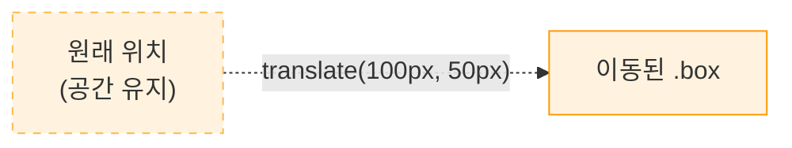
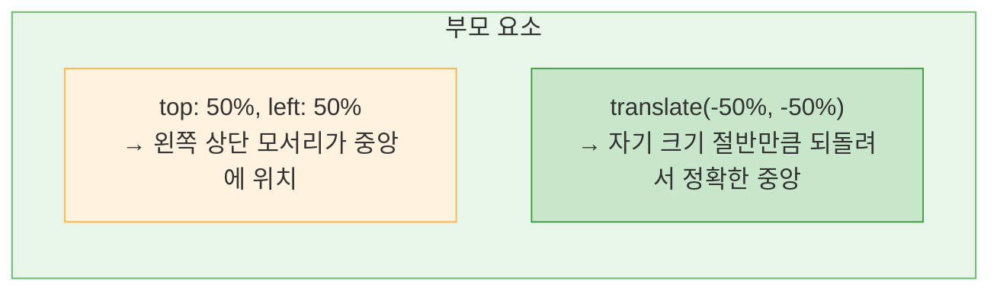
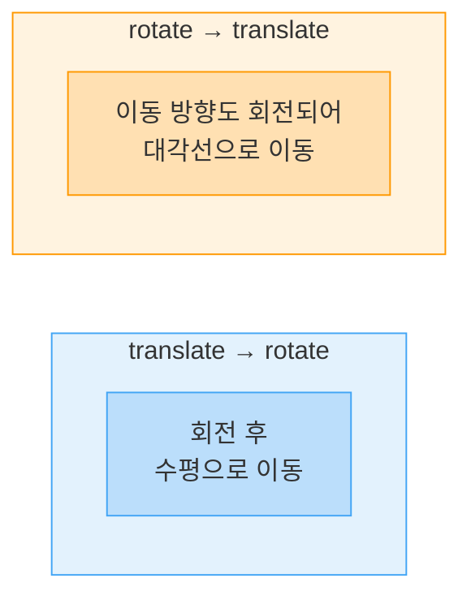
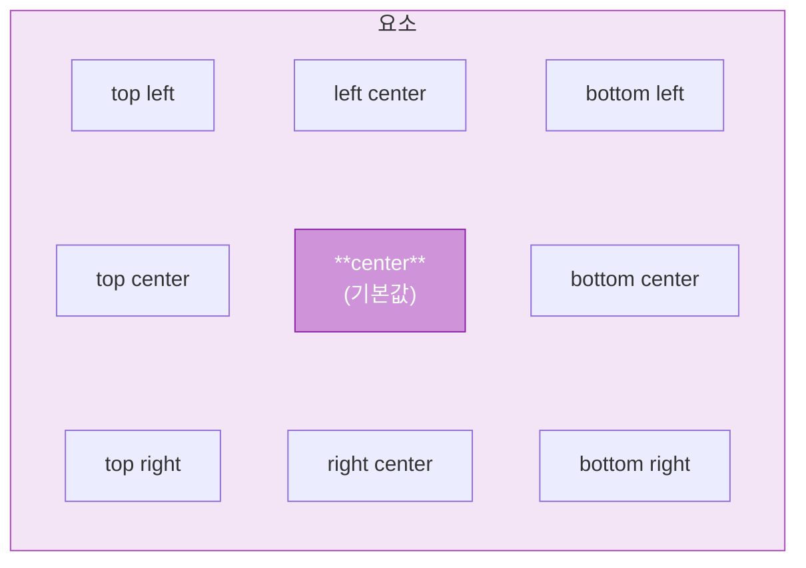
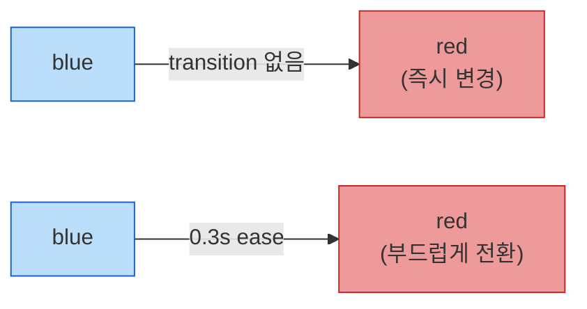
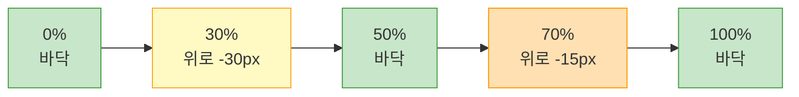
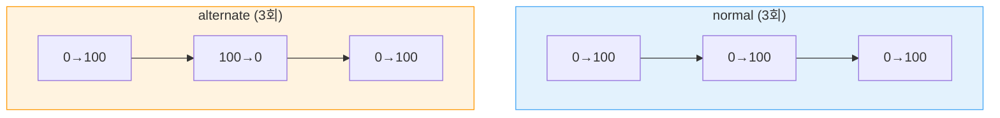
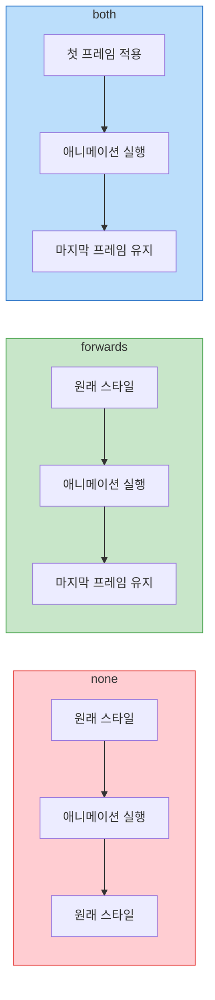
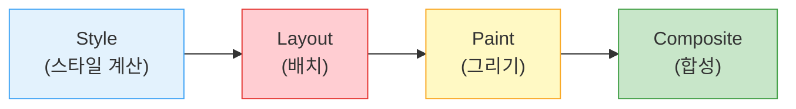

> 이 글은 주니어 개발자가 학습하며 정리한 내용입니다. 잘못된 정보가 있을 수 있으니, 발견하시면 편하게 알려주세요.

## Transform이란

`transform` 속성은 요소의 **시각적 형태를 변형**하는 속성이다. 요소의 크기, 회전, 이동, 기울임 등을 적용할 수 있다. 핵심은 문서 흐름에 **영향을 주지 않는다**는 점이다. 다른 요소의 레이아웃을 밀어내지 않고 시각적으로만 변형된다.

transform은 새로운 **Stacking Context**과 **컨테이닝 블록**을 생성하며, GPU 가속을 활용하므로 **애니메이션 성능이 좋다**.

```css
.box {
  transform: rotate(45deg); /* 45도 회전 */
  transform: scale(1.5); /* 1.5배 확대 */
  transform: translate(100px, 50px); /* x: 100px, y: 50px 이동 */
}
```

### transform 함수 종류

| 함수              | 설명       | 예시                              |
| ----------------- | ---------- | --------------------------------- |
| `translate(x, y)` | 이동       | `translate(50px, 20px)`           |
| `translateX(x)`   | X축 이동   | `translateX(100px)`               |
| `translateY(y)`   | Y축 이동   | `translateY(-50%)`                |
| `rotate(angle)`   | 회전       | `rotate(45deg)`                   |
| `scale(x, y)`     | 확대/축소  | `scale(1.5)` 또는 `scale(2, 0.5)` |
| `scaleX(x)`       | X축 확대   | `scaleX(2)`                       |
| `scaleY(y)`       | Y축 축소   | `scaleY(0.5)`                     |
| `skew(x, y)`      | 기울임     | `skew(10deg, 5deg)`               |
| `skewX(angle)`    | X축 기울임 | `skewX(15deg)`                    |
| `skewY(angle)`    | Y축 기울임 | `skewY(-10deg)`                   |

## translate (이동)

요소를 **현재 위치에서 이동**시킨다. `%` 값은 **자기 자신의 크기**를 기준으로 계산되며, 레이아웃에 영향 없이 이동하므로 애니메이션에 최적이다.

```css
.box {
  transform: translate(100px, 50px); /* X: 오른쪽 100px, Y: 아래 50px */
  transform: translate(-50%, -50%); /* 자신의 너비/높이의 절반만큼 왼쪽 위로 */
  transform: translateX(200px); /* X축만 이동 */
  transform: translateY(-100%); /* Y축만 이동 (자기 높이만큼 위로) */
}
```



원래 자리의 공간은 그대로 유지된다. 다른 요소에 영향을 주지 않는다는 점에서 `position: relative`의 이동과 비슷하다.

### translate로 가운데 정렬

translate의 가장 대표적인 활용법이다. `%` 값이 자기 자신의 크기를 기준으로 계산되는 특성을 이용한다.

```css
.center {
  position: absolute;
  top: 50%; /* 부모의 50% 지점으로 */
  left: 50%;
  transform: translate(-50%, -50%); /* 자기 크기의 절반만큼 되돌림 */
}
```



`top: 50%`는 부모의 50% 지점에 요소의 왼쪽 상단 모서리를 놓는다. 여기서 `translate(-50%, -50%)`로 자기 크기의 절반만큼 왼쪽 위로 되돌리면 정확한 중앙에 위치하게 된다.

## rotate (회전)

요소를 **지정한 각도만큼 회전**시킨다. 양수 값은 **시계 방향**, 음수 값은 **반시계 방향**이다.

단위는 `deg`(도), `turn`(1회전 = 360deg), `rad`(라디안)을 사용할 수 있다.

```css
.box {
  transform: rotate(45deg); /* 시계 방향 45도 */
  transform: rotate(-90deg); /* 반시계 방향 90도 */
  transform: rotate(0.5turn); /* 반 바퀴 (= 180deg) */
}
```

기본적으로 요소의 **중심점**을 기준으로 회전한다. 기준점은 `transform-origin`으로 변경할 수 있다.

## scale (확대/축소)

요소를 **확대 또는 축소**시킨다. `1`이 원래 크기이며, `1`보다 크면 확대, `0`~`1`이면 축소된다. 음수 값을 주면 뒤집힌다(mirror 효과).

```css
.box {
  transform: scale(1.5); /* 가로·세로 1.5배 확대 */
  transform: scale(2, 0.5); /* 가로 2배, 세로 0.5배 */
  transform: scaleX(-1); /* 좌우 반전 (mirror) */
  transform: scale(0); /* 완전히 사라짐 */
}
```

## skew (기울임)

요소를 **기울여서 평행사변형 모양**으로 변형한다.

```css
.box {
  transform: skew(15deg, 0); /* X축으로 15도 기울임 */
  transform: skewX(20deg); /* X축만 기울임 */
  transform: skewY(-10deg); /* Y축만 기울임 */
}
```

## 여러 transform 함수 조합

하나의 `transform` 속성에 여러 함수를 **공백으로 구분**하여 나열할 수 있다. 이때 **순서가 중요**한데, 오른쪽에서 왼쪽으로 적용된다(수학적 행렬 곱셈 순서).

```css
/* 올바른 조합 — 공백으로 나열 */
.box {
  transform: translate(100px, 0) rotate(45deg) scale(1.5);
  /* 적용 순서: scale → rotate → translate */
}

/* 잘못된 조합 — 마지막 선언만 적용됨 */
.box {
  transform: translate(100px, 0); /* 무시됨 */
  transform: rotate(45deg); /* 이것만 적용됨 */
}
```

### 순서에 따른 결과 차이

```css
/* translate를 바깥에 쓰면: 회전 후 이동 → 수평 이동 */
.box-a {
  transform: translate(100px, 0) rotate(45deg);
  /* 1. 45도 회전 → 2. 오른쪽으로 100px 수평 이동 */
}

/* rotate를 바깥에 쓰면: 이동 후 회전 → 이동 방향도 회전됨! */
.box-b {
  transform: rotate(45deg) translate(100px, 0);
  /* 1. 오른쪽으로 100px 이동 → 2. 45도 회전 */
  /* 이동 방향도 회전되어 대각선으로 이동한 것처럼 보임 */
}
```



> **기억하기:** transform 함수는 **오른쪽에서 왼쪽**으로 적용된다. 가장 오른쪽 함수가 먼저 실행된다고 생각하면 된다.

## transform-origin (변환 기준점)

transform이 적용되는 **기준점**(중심)을 변경하는 속성이다. 기본값은 `center center`(= `50% 50%`)이며, 회전, 확대/축소, 기울임의 중심점이 달라진다.

```css
.box {
  transform-origin: center center; /* 기본값 — 중심 */
  transform-origin: top left; /* 왼쪽 상단 */
  transform-origin: 0% 100%; /* 왼쪽 하단 */
  transform-origin: 100% 0%; /* 오른쪽 상단 */
  transform-origin: 50px 30px; /* 왼쪽 상단에서 50px, 30px 지점 */
}
```



```css
/* 활용 — 왼쪽 변을 축으로 회전 (문 열리는 효과) */
.door {
  transform-origin: left center;
  transform: rotate(-90deg);
}

/* 호버 시 왼쪽 상단 기준으로 확대 */
.card:hover {
  transform-origin: top left;
  transform: scale(1.1);
}
```

---

## Transition이란

CSS 속성이 변할 때 중간 과정을 자연스럽게 **애니메이션으로 보여주는 기능**이다. A 상태에서 B 상태로 **부드럽게 전환**되며, 주로 `:hover`, `:focus`, `:active`, 클래스 변경 등의 **상태 변화 시** 사용한다.

```css
.button {
  background-color: blue;
  transition: background-color 0.3s ease;
}

.button:hover {
  background-color: red;
}
```



transition이 없으면 색상이 즉시 바뀌지만, transition을 적용하면 0.3초에 걸쳐 중간 색상들을 거치며 자연스럽게 전환된다.

### transition 하위 속성

| 속성                         | 설명              | 기본값 | 예시                            |
| ---------------------------- | ----------------- | ------ | ------------------------------- |
| `transition-property`        | 전환할 CSS 속성   | `all`  | `background-color`, `transform` |
| `transition-duration`        | 전환 지속 시간    | `0s`   | `0.3s`, `300ms`                 |
| `transition-timing-function` | 전환 속도 곡선    | `ease` | `ease`, `linear`, `ease-in-out` |
| `transition-delay`           | 시작 전 대기 시간 | `0s`   | `0.1s`, `500ms`                 |

```css
/* 개별 속성으로 지정 */
.box {
  transition-property: transform, opacity;
  transition-duration: 0.3s, 0.5s;
  transition-timing-function: ease, linear;
  transition-delay: 0s, 0.1s;
}

/* 단축 속성 (가장 많이 사용) */
/* transition: property duration timing-function delay; */
.box {
  transition:
    transform 0.3s ease 0s,
    opacity 0.5s linear 0.1s;
}

/* 모든 속성에 동일한 전환 적용 */
.box {
  transition: all 0.3s ease;
}
```

## transition-property (전환 대상)

어떤 CSS 속성에 전환 효과를 적용할지 지정한다. `all`을 쓰면 변경되는 모든 속성에 전환이 적용되지만, **필요한 속성만 명시하는 것이 성능과 의도 면에서 좋다**.

```css
/* 좋은 예 — 필요한 속성만 명시 */
.box {
  transition:
    transform 0.3s,
    opacity 0.3s;
}

/* all은 편리하지만 의도하지 않은 속성까지 전환될 수 있음 */
.box {
  transition: all 0.3s ease;
}
```

### 전환 가능한 속성과 불가능한 속성

| 전환 가능                        | 전환 불가                            |
| -------------------------------- | ------------------------------------ |
| `opacity`                        | `display`                            |
| `transform`                      | `visibility` (on/off 전환만 가능)    |
| `color`, `background-color`      | `font-family`                        |
| `width`, `height`                | `background-image` (그라데이션 제외) |
| `margin`, `padding`              | `position`                           |
| `border-radius`                  | `float`                              |
| `box-shadow`                     | `content`                            |
| `top`, `left`, `right`, `bottom` |                                      |

> **성능 팁**
>
> `transform`과 `opacity`는 GPU가 직접 처리하므로 가장 성능이 좋은 전환 대상이다. `width`, `height`, `margin` 등은 레이아웃 재계산(reflow)을 유발하므로, 가능하면 `transform: scale()`이나 `transform: translate()`로 대체하는 것이 좋다.

## transition-duration (지속 시간)

전환이 완료되기까지 걸리는 시간이다. `s`(초) 또는 `ms`(밀리초) 단위를 사용하며, `0s`이면 전환 없이 즉시 변경된다.

```css
.box {
  transition-duration: 0.3s; /* 0.3초 */
  transition-duration: 300ms; /* 300밀리초 (= 0.3초) */
}
```

### 용도별 권장 시간

| 용도                     | 권장 시간         |
| ------------------------ | ----------------- |
| 호버 효과 (색상, 투명도) | `0.15s` ~ `0.25s` |
| 크기/위치 변화           | `0.2s` ~ `0.4s`   |
| 페이지 전환/모달         | `0.3s` ~ `0.5s`   |
| 복잡한 애니메이션        | `0.5s` ~ `1s`     |

## transition-timing-function (속도 곡선)

전환이 진행되는 **속도의 변화 패턴**을 결정한다. 일정한 속도, 점점 빨라짐, 점점 느려짐 등의 패턴을 지정할 수 있다.

| 값                             | 설명                     | 특징                     |
| ------------------------------ | ------------------------ | ------------------------ |
| `ease` (기본)                  | 느리게 → 빠르게 → 느리게 | 가장 자연스러운 느낌     |
| `linear`                       | 일정한 속도              | 기계적인 느낌            |
| `ease-in`                      | 느리게 시작 → 빠르게 끝  | 가속                     |
| `ease-out`                     | 빠르게 시작 → 느리게 끝  | 감속 (자연스러운 착지)   |
| `ease-in-out`                  | 느리게 → 빠르게 → 느리게 | ease와 비슷하지만 대칭적 |
| `cubic-bezier(x1, y1, x2, y2)` | 커스텀 곡선              | 세밀한 제어              |
| `steps(n, start/end)`          | n단계로 끊어서 전환      | 스프라이트 애니메이션    |

```css
.box {
  transition-timing-function: ease;
  transition-timing-function: linear;
  transition-timing-function: cubic-bezier(0.68, -0.55, 0.27, 1.55); /* 탄성 효과 */
  transition-timing-function: steps(4); /* 4단계로 끊어서 전환 */
}
```

## transition-delay (지연 시간)

전환 시작 전 **대기 시간**을 지정한다. 여러 속성에 다른 delay를 주면 **순차적 전환** 효과를 만들 수 있다.

```css
/* 호버 후 0.2초 뒤에 전환 시작 */
.box {
  transition: transform 0.3s ease 0.2s;
}

/* 순차적 전환 효과 */
.box {
  transition:
    transform 0.3s ease 0s,
    opacity 0.3s ease 0.15s,
    background-color 0.3s ease 0.3s;
  /* transform → 0.15초 후 opacity → 0.3초 후 background-color */
}
```

## transition 활용 패턴

### 호버 시 부드러운 확대

```css
.card {
  transition: transform 0.3s ease;
}

.card:hover {
  transform: scale(1.05);
}
```

### 버튼 호버 효과

```css
.button {
  background-color: #3498db;
  color: white;
  transition:
    background-color 0.2s ease,
    transform 0.1s ease;
}

.button:hover {
  background-color: #2980b9;
  transform: translateY(-2px);
}

.button:active {
  transform: translateY(0);
}
```

### 메뉴 슬라이드

```css
.menu {
  transform: translateX(-100%);
  transition: transform 0.3s ease-out;
}

.menu.open {
  transform: translateX(0);
}
```

### 페이드 인/아웃

```css
.modal {
  opacity: 0;
  visibility: hidden;
  transition:
    opacity 0.3s ease,
    visibility 0.3s;
}

.modal.active {
  opacity: 1;
  visibility: visible;
}
```

> **주의 — `display`와 transition**
>
> `display: none`에서 `display: block`으로의 변화는 전환이 불가능하다. 대신 `opacity` + `visibility`를 조합하거나, 최신 CSS의 `@starting-style`과 `transition-behavior: allow-discrete`를 사용할 수 있다.

---

## Animation이란

**키프레임**(@keyframes)을 정의하여 **복잡한 다단계 애니메이션**을 만드는 기능이다. transition이 A → B 두 상태 간의 전환이라면, animation은 **여러 중간 단계**를 가질 수 있다. 상태 변화 없이 **자동으로 실행**할 수 있고, **반복, 역방향, 일시정지** 등 세밀한 제어가 가능하다.

```css
/* 1. 키프레임 정의 */
@keyframes slide-in {
  from {
    transform: translateX(-100%);
    opacity: 0;
  }
  to {
    transform: translateX(0);
    opacity: 1;
  }
}

/* 2. 요소에 애니메이션 적용 */
.element {
  animation: slide-in 0.5s ease forwards;
}
```

### transition vs animation

| 특성        | Transition                 | Animation                           |
| ----------- | -------------------------- | ----------------------------------- |
| 트리거      | 상태 변화 필요 (:hover 등) | 자동 실행 가능                      |
| 중간 단계   | 시작 ↔ 끝 (2단계만)        | 여러 단계 (0% ~ 100%)               |
| 반복        | 불가                       | 가능 (`infinite`)                   |
| 역방향      | 불가                       | 가능 (`reverse`, `alternate`)       |
| 일시정지    | 불가                       | 가능 (`paused`)                     |
| 적합한 용도 | 간단한 인터랙션            | 복잡하거나 자동 실행하는 애니메이션 |

## @keyframes (키프레임 정의)

애니메이션의 **중간 단계**, 시점별 스타일을 정의한다. `from`/`to` 또는 `0%` ~ `100%` 퍼센트로 구간을 지정한다.

```css
/* from/to 사용 (2단계) */
@keyframes fade-in {
  from {
    opacity: 0;
  }
  to {
    opacity: 1;
  }
}

/* 퍼센트 사용 (다단계) */
@keyframes bounce {
  0% {
    transform: translateY(0);
  }
  30% {
    transform: translateY(-30px);
  }
  50% {
    transform: translateY(0);
  }
  70% {
    transform: translateY(-15px);
  }
  100% {
    transform: translateY(0);
  }
}

/* 여러 구간에 같은 스타일 */
@keyframes blink {
  0%,
  100% {
    opacity: 1;
  }
  50% {
    opacity: 0;
  }
}
```



bounce 키프레임은 요소가 위로 튀었다가 점점 작게 반복하며 착지하는 효과를 만든다.

## animation 하위 속성

| 속성                        | 설명              | 기본값    | 예시                    |
| --------------------------- | ----------------- | --------- | ----------------------- |
| `animation-name`            | @keyframes 이름   | `none`    | `slide-in`              |
| `animation-duration`        | 지속 시간         | `0s`      | `0.5s`, `2s`            |
| `animation-timing-function` | 속도 곡선         | `ease`    | `linear`, `ease-in-out` |
| `animation-delay`           | 시작 전 대기 시간 | `0s`      | `0.3s`, `1s`            |
| `animation-iteration-count` | 반복 횟수         | `1`       | `3`, `infinite`         |
| `animation-direction`       | 재생 방향         | `normal`  | `reverse`, `alternate`  |
| `animation-fill-mode`       | 실행 전후 스타일  | `none`    | `forwards`, `both`      |
| `animation-play-state`      | 재생/일시정지     | `running` | `paused`                |

```css
/* 단축 속성 */
/* animation: name duration timing-function delay count direction fill-mode play-state; */
.box {
  animation: bounce 1s ease-in-out 0s infinite alternate forwards running;
}

/* 실전에서는 필요한 것만 작성 */
.box {
  animation: bounce 1s ease-in-out infinite alternate;
}
```

## animation-iteration-count (반복 횟수)

```css
.box {
  animation-iteration-count: 1; /* 1번 (기본값) */
  animation-iteration-count: 3; /* 3번 반복 */
  animation-iteration-count: infinite; /* 무한 반복 */
  animation-iteration-count: 0.5; /* 절반만 실행 (50%까지) */
}
```

## animation-direction (재생 방향)

| 값                  | 동작                                |
| ------------------- | ----------------------------------- |
| `normal` (기본)     | 0% → 100% 정방향 반복               |
| `reverse`           | 100% → 0% 역방향 반복               |
| `alternate`         | 정방향 → 역방향 → 정방향 ... 번갈아 |
| `alternate-reverse` | 역방향 → 정방향 → 역방향 ... 번갈아 |



```css
/* alternate — 부드러운 왕복 효과 */
@keyframes float {
  from {
    transform: translateY(0);
  }
  to {
    transform: translateY(-20px);
  }
}

.icon {
  animation: float 2s ease-in-out infinite alternate;
  /* 위아래로 부드럽게 떠다니는 효과 */
}
```

## animation-fill-mode (전후 스타일 유지)

애니메이션이 **시작 전**과 **종료 후**에 요소 스타일을 어떻게 처리할지 결정한다. 기본적으로 애니메이션이 끝나면 원래 스타일로 돌아간다.

| 값            | 시작 전              | 종료 후                    |
| ------------- | -------------------- | -------------------------- |
| `none` (기본) | 원래 스타일          | 원래 스타일                |
| `forwards`    | 원래 스타일          | 마지막 키프레임(100%) 유지 |
| `backwards`   | 첫 키프레임(0%) 적용 | 원래 스타일                |
| `both`        | 첫 키프레임(0%) 적용 | 마지막 키프레임(100%) 유지 |

```css
/* fill-mode 없음 — 애니메이션 끝나면 원래로 돌아감 */
.box {
  opacity: 1;
  animation: fade-out 0.5s ease;
}

@keyframes fade-out {
  to {
    opacity: 0;
  }
}
/* 결과: 0.5초간 사라졌다가 다시 나타남! */

/* forwards — 마지막 상태 유지 */
.box {
  opacity: 1;
  animation: fade-out 0.5s ease forwards;
}
/* 결과: 0.5초간 사라지고 사라진 채 유지됨 */
```



> `forwards`는 가장 자주 사용되는 fill-mode다. 한 번 실행되고 끝나는 등장 애니메이션에서 마지막 상태를 유지하려면 반드시 `forwards`를 지정해야 한다.

## animation-play-state (재생/일시정지)

```css
.box {
  animation: spin 2s linear infinite;
  animation-play-state: running; /* 기본값 — 재생 중 */
}

/* 호버 시 일시정지 */
.box:hover {
  animation-play-state: paused;
}
```

## 여러 애니메이션 동시 적용

쉼표로 구분하여 여러 애니메이션을 **동시에** 적용할 수 있다.

```css
.box {
  animation:
    slide-in 0.5s ease forwards,
    fade-in 0.3s ease forwards,
    bounce 1s ease 0.5s;
}
```

## animation 활용 패턴

### 로딩 스피너

```css
@keyframes spin {
  to {
    transform: rotate(360deg);
  }
}

.spinner {
  width: 40px;
  height: 40px;
  border: 4px solid #ddd;
  border-top-color: #3498db;
  border-radius: 50%;
  animation: spin 0.8s linear infinite;
}
```

### 펄스 효과 (알림 뱃지)

```css
@keyframes pulse {
  0% {
    transform: scale(1);
  }
  50% {
    transform: scale(1.1);
  }
  100% {
    transform: scale(1);
  }
}

.badge {
  animation: pulse 2s ease-in-out infinite;
}
```

### 순차적 페이드인 (리스트 아이템)

```css
@keyframes fade-up {
  from {
    opacity: 0;
    transform: translateY(20px);
  }
  to {
    opacity: 1;
    transform: translateY(0);
  }
}

.list-item {
  opacity: 0; /* 초기 상태 */
  animation: fade-up 0.4s ease forwards;
}

.list-item:nth-child(1) {
  animation-delay: 0s;
}
.list-item:nth-child(2) {
  animation-delay: 0.1s;
}
.list-item:nth-child(3) {
  animation-delay: 0.2s;
}
.list-item:nth-child(4) {
  animation-delay: 0.3s;
}
```

### 타이핑 효과

```css
@keyframes typing {
  from {
    width: 0;
  }
  to {
    width: 100%;
  }
}

@keyframes blink-caret {
  50% {
    border-color: transparent;
  }
}

.typing-text {
  overflow: hidden;
  white-space: nowrap;
  border-right: 3px solid;
  animation:
    typing 3s steps(30) forwards,
    blink-caret 0.75s step-end infinite;
}
```

### 쉐이크 효과 (에러 표시)

```css
@keyframes shake {
  0%,
  100% {
    transform: translateX(0);
  }
  20% {
    transform: translateX(-10px);
  }
  40% {
    transform: translateX(10px);
  }
  60% {
    transform: translateX(-5px);
  }
  80% {
    transform: translateX(5px);
  }
}

.error {
  animation: shake 0.5s ease;
}
```

---

## 성능 고려사항

### 브라우저 렌더링 파이프라인

브라우저가 화면을 그리는 과정은 **Style → Layout → Paint → Composite** 순서다. CSS 속성에 따라 어디서부터 다시 계산하는지가 달라진다.



| 단계             | 유발하는 속성                                         | 비용 |
| ---------------- | ----------------------------------------------------- | ---- |
| Layout (배치)    | `width`, `height`, `margin`, `padding`, `top`, `left` | 높음 |
| Paint (그리기)   | `color`, `background`, `border`, `box-shadow`         | 중간 |
| Composite (합성) | `transform`, `opacity`                                | 낮음 |

### 성능 최적화 원칙

```css
/* 성능이 나쁜 애니메이션 — Layout 유발 */
.box {
  transition:
    width 0.3s,
    height 0.3s,
    margin-left 0.3s;
}

.box:hover {
  width: 200px;
  height: 200px;
  margin-left: 50px;
}

/* 성능이 좋은 애니메이션 — Composite만 유발 */
.box {
  transition:
    transform 0.3s,
    opacity 0.3s;
}

.box:hover {
  transform: scale(1.2) translateX(50px);
  opacity: 0.8;
}
```

### will-change

브라우저에 **곧 변경될 속성**을 미리 알려주는 힌트다. 브라우저가 해당 요소를 별도의 레이어로 준비하여 애니메이션 성능을 높인다.

```css
.animated {
  will-change: transform, opacity;
}
```

> **주의:** `will-change`를 너무 많은 요소에 남용하면 오히려 메모리를 낭비한다. 실제로 애니메이션이 적용되는 요소에만 사용하고, 애니메이션이 끝나면 제거하는 것이 좋다.

### 접근성 — prefers-reduced-motion

모션에 민감한 사용자를 위한 미디어 쿼리다. 운영체제에서 "동작 줄이기" 설정을 켜면 애니메이션을 최소화할 수 있다.

```css
@media (prefers-reduced-motion: reduce) {
  *,
  *::before,
  *::after {
    animation-duration: 0.01ms !important;
    animation-iteration-count: 1 !important;
    transition-duration: 0.01ms !important;
  }
}
```

---

## 세 가지의 관계

Transform, Transition, Animation은 각각 다른 역할을 담당하며 함께 조합하여 사용한다.

| 기능           | 역할                                   | 비유                     |
| -------------- | -------------------------------------- | ------------------------ |
| **Transform**  | **무엇을** 변형할지 (이동, 회전, 확대) | 동작의 종류              |
| **Transition** | **언제, 어떻게** 부드럽게 전환할지     | 자동문 (열림 ↔ 닫힘)     |
| **Animation**  | **어떤 시나리오로** 움직일지           | 영화 (시나리오대로 연기) |

```css
/* 세 가지를 조합한 예시 */

/* Animation — 최초 로딩 시 등장 효과 */
@keyframes card-appear {
  from {
    opacity: 0;
    transform: translateY(30px);
  }
  to {
    opacity: 1;
    transform: translateY(0);
  }
}

.card {
  /* Transform: 초기 상태 정의 */
  transform: translateY(0) scale(1);

  /* Transition: 호버 등 상태 변화 시 부드러운 전환 */
  transition:
    transform 0.3s ease,
    box-shadow 0.3s ease;

  /* Animation: 페이지 로드 시 등장 효과 */
  animation: card-appear 0.5s ease forwards;
}

.card:hover {
  /* Transform: 호버 상태의 변형 (Transition이 부드럽게 전환해줌) */
  transform: translateY(-10px) scale(1.02);
  box-shadow: 0 20px 40px rgba(0, 0, 0, 0.15);
}
```
