> 이 글은 주니어 개발자가 학습하며 정리한 내용입니다. 잘못된 정보가 있을 수 있으니, 발견하시면 편하게 알려주세요.

## Flexbox란

Flexbox는 **1차원 레이아웃** 시스템이다. 한 방향, 가로 또는 세로로 요소를 배치하는 데 특화되어 있다. 요소 간의 간격, 정렬, 순서, 크기 분배를 유연하게 제어할 수 있으며, 과거 `float`이나 `inline-block` 해킹 없이 깔끔한 레이아웃을 구현할 수 있다.

부모 요소에 `display: flex`를 선언하면 자식 요소들이 **flex 아이템**이 된다.

```css
.container {
  display: flex;
}
```

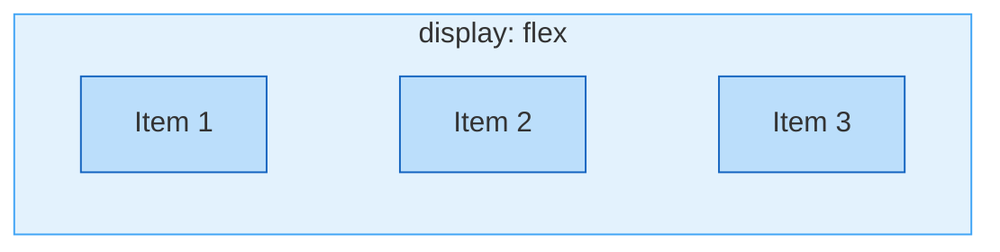

기본적으로 아이템들은 가로 방향으로 나란히 배치된다.

### 축 개념

Flexbox는 **주축**과 **교차축**, 2개의 축을 가진다. `flex-direction`에 따라 주축의 방향이 달라지며, 주축 방향으로 아이템이 배치되고 교차축 방향으로 정렬된다.

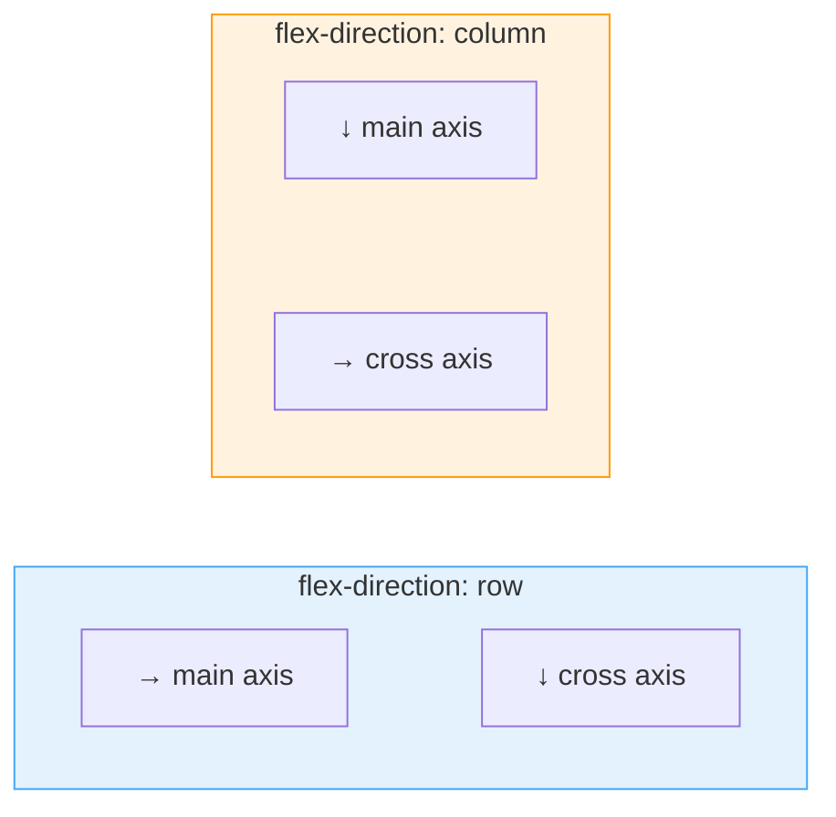

`row`일 때는 가로가 주축, 세로가 교차축이 된다. `column`일 때는 세로가 주축, 가로가 교차축이 된다.

## 컨테이너 속성

컨테이너 속성은 부모 요소에 적용하여 자식 아이템들의 전체적인 배치를 결정한다.

| 속성              | 설명                  | 기본값       |
| ----------------- | --------------------- | ------------ |
| `flex-direction`  | 주축 방향             | `row`        |
| `flex-wrap`       | 줄바꿈 여부           | `nowrap`     |
| `justify-content` | 주축 정렬             | `flex-start` |
| `align-items`     | 교차축 정렬 — 한 줄   | `stretch`    |
| `align-content`   | 교차축 정렬 — 여러 줄 | `stretch`    |
| `gap`             | 아이템 간격           | `0`          |

### flex-direction

아이템이 배치되는 **주축의 방향**을 결정한다.

| 값               | 방향 | 설명            |
| ---------------- | ---- | --------------- |
| `row` (기본)     | →    | 왼쪽에서 오른쪽 |
| `row-reverse`    | ←    | 오른쪽에서 왼쪽 |
| `column`         | ↓    | 위에서 아래     |
| `column-reverse` | ↑    | 아래에서 위     |

```css
.container {
  display: flex;
  flex-direction: row; /* 기본 — 가로 배치 */
  flex-direction: column; /* 세로 배치 */
  flex-direction: row-reverse; /* 가로 역순 */
  flex-direction: column-reverse; /* 세로 역순 */
}
```

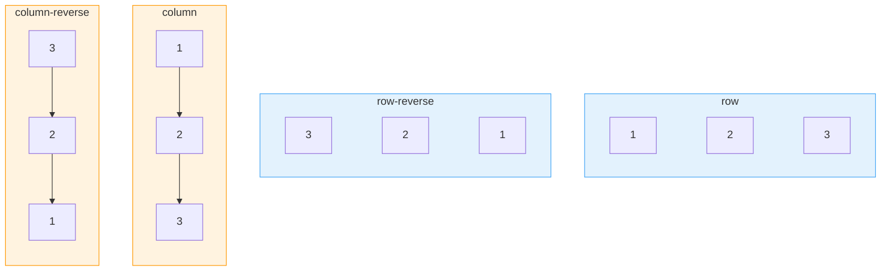

### flex-wrap

아이템이 컨테이너를 **넘칠 때** 줄바꿈 여부를 결정한다. 기본값 `nowrap`은 아이템을 한 줄에 압축하여 표시한다.

| 값              | 설명                            |
| --------------- | ------------------------------- |
| `nowrap` (기본) | 줄바꿈 없음 — 한 줄에 모두 배치 |
| `wrap`          | 넘치면 다음 줄로                |
| `wrap-reverse`  | 줄바꿈하되 역방향으로           |

```css
.container {
  display: flex;
  flex-wrap: nowrap; /* 기본 — 한 줄 */
  flex-wrap: wrap; /* 줄바꿈 허용 */
  flex-wrap: wrap-reverse; /* 역방향 줄바꿈 */
}
```

> **단축 속성 — flex-flow**
>
> `flex-direction`과 `flex-wrap`을 한 번에 지정할 수 있다.
>
> ```css
> .container {
>   flex-flow: row wrap; /* direction: row + wrap: wrap */
>   flex-flow: column nowrap;
> }
> ```

### justify-content

**주축** 방향으로 아이템들의 배치와 간격을 결정한다.

| 값              | 설명                                                 |
| --------------- | ---------------------------------------------------- |
| `flex-start`    | 시작점에 몰아서 배치                                 |
| `flex-end`      | 끝점에 몰아서 배치                                   |
| `center`        | 가운데 정렬                                          |
| `space-between` | 첫/끝 아이템은 양 끝, 나머지 균등 간격               |
| `space-around`  | 각 아이템 양쪽에 균등 간격, 양 끝 간격은 중간의 절반 |
| `space-evenly`  | 모든 간격이 완전히 균등                              |

```css
.container {
  display: flex;
  justify-content: flex-start; /* 기본 */
  justify-content: center; /* 가운데 */
  justify-content: space-between; /* 양 끝 + 균등 */
  justify-content: space-evenly; /* 완전 균등 */
}
```

```mermaid
flowchart TB
  subgraph sb["space-between"]
    direction LR
    SB1["1"] ~~~ SB_space1[" "] ~~~ SB2["2"] ~~~ SB_space2[" "] ~~~ SB3["3"]
  end

  subgraph sa["space-around"]
    direction LR
    SA_l[" "] ~~~ SA1["1"] ~~~ SA_m1[" "] ~~~ SA2["2"] ~~~ SA_m2[" "] ~~~ SA3["3"] ~~~ SA_r[" "]
  end

  subgraph se["space-evenly"]
    direction LR
    SE_l["  "] ~~~ SE1["1"] ~~~ SE_m1["  "] ~~~ SE2["2"] ~~~ SE_m2["  "] ~~~ SE3["3"] ~~~ SE_r["  "]
  end

  style sb fill:#e3f2fd,stroke:#42a5f5
  style sa fill:#fff3e0,stroke:#ff9800
  style se fill:#c8e6c9,stroke:#43a047
  style SB_space1 fill:none,stroke:none
  style SB_space2 fill:none,stroke:none
  style SA_l fill:none,stroke:none
  style SA_r fill:none,stroke:none
  style SA_m1 fill:none,stroke:none
  style SA_m2 fill:none,stroke:none
  style SE_l fill:none,stroke:none
  style SE_r fill:none,stroke:none
  style SE_m1 fill:none,stroke:none
  style SE_m2 fill:none,stroke:none
```

`space-between`은 첫/끝 아이템이 양 끝에 붙고 나머지가 균등 간격이다. `space-around`는 각 아이템 양쪽에 같은 간격이 붙어 양 끝 간격이 중간의 절반이 된다. `space-evenly`는 모든 간격이 동일하다.

### align-items

**교차축** 방향으로 각 아이템의 정렬을 결정한다.

| 값               | 설명                                     |
| ---------------- | ---------------------------------------- |
| `stretch` (기본) | 교차축 방향으로 컨테이너 크기만큼 늘어남 |
| `flex-start`     | 교차축 시작점에 정렬                     |
| `flex-end`       | 교차축 끝점에 정렬                       |
| `center`         | 교차축 가운데 정렬                       |
| `baseline`       | 텍스트 기준선에 맞춰 정렬                |

```css
.container {
  display: flex;
  align-items: stretch; /* 기본 — 높이 채움 */
  align-items: center; /* 세로 가운데 */
  align-items: flex-start; /* 위쪽 정렬 */
  align-items: baseline; /* 텍스트 기준선 */
}
```

`stretch`가 기본값이므로 아이템에 높이를 지정하지 않으면 컨테이너 높이만큼 늘어난다. `center`를 사용하면 교차축 방향으로 가운데 정렬된다.

### align-content

`flex-wrap: wrap`으로 **여러 줄**이 생겼을 때, 줄 사이의 간격과 배치를 결정한다. 한 줄일 때는 효과가 없다. `justify-content`와 동일한 값들을 사용한다.

```css
.container {
  display: flex;
  flex-wrap: wrap;
  align-content: flex-start; /* 위쪽에 몰아서 */
  align-content: center; /* 세로 가운데 */
  align-content: space-between; /* 위/아래 끝 + 균등 간격 */
  align-content: stretch; /* 기본 — 줄 높이를 균등하게 늘림 */
}
```

> **align-items vs align-content**
>
> `align-items`는 각 **아이템**이 자기 줄 안에서 어떻게 정렬되는지를 결정한다. `align-content`는 **줄 자체**가 컨테이너 안에서 어떻게 배치되는지를 결정한다. `align-content`는 반드시 `flex-wrap: wrap`과 함께 사용해야 효과가 있다.

### gap

아이템 사이의 **간격**을 지정한다. margin 없이도 깔끔한 간격을 만들 수 있다.

```css
.container {
  display: flex;
  gap: 16px; /* 행/열 간격 모두 16px */
  gap: 16px 24px; /* 행 간격 16px, 열 간격 24px */
  row-gap: 16px; /* 행 간격만 */
  column-gap: 24px; /* 열 간격만 */
}
```

첫 번째 아이템 앞과 마지막 아이템 뒤에는 간격이 생기지 않는다. 이 점이 margin과 다르다.

## 아이템 속성

아이템 속성은 자식 요소에 적용하여 개별 아이템의 크기와 정렬을 제어한다.

| 속성          | 설명                      | 기본값 |
| ------------- | ------------------------- | ------ |
| `flex-grow`   | 남은 공간을 차지하는 비율 | `0`    |
| `flex-shrink` | 부족할 때 줄어드는 비율   | `1`    |
| `flex-basis`  | 기본 크기                 | `auto` |
| `align-self`  | 개별 교차축 정렬          | `auto` |
| `order`       | 배치 순서                 | `0`    |

### flex-grow

컨테이너에 **남은 공간**이 있을 때 아이템이 얼마나 늘어날지를 비율로 결정한다. 기본값 `0`이면 늘어나지 않는다.

```css
.item-1 {
  flex-grow: 1;
} /* 남은 공간의 1/3 */
.item-2 {
  flex-grow: 1;
} /* 남은 공간의 1/3 */
.item-3 {
  flex-grow: 1;
} /* 남은 공간의 1/3 */
```

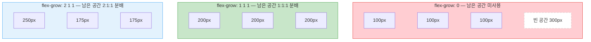

컨테이너 600px, 각 아이템 기본 100px일 때 남은 300px을 비율대로 분배한다.

### flex-shrink

아이템의 총 크기가 컨테이너보다 **클 때** 아이템이 얼마나 줄어들지를 비율로 결정한다. 기본값 `1`이면 균등하게 줄어들고, `0`이면 줄어들지 않는다.

```css
.item-1 {
  flex-shrink: 1;
} /* 기본 — 줄어듦 */
.item-2 {
  flex-shrink: 0;
} /* 절대 줄어들지 않음 */
.item-3 {
  flex-shrink: 2;
} /* 2배 더 많이 줄어듦 */
```

### flex-basis

아이템의 **기본 크기**를 지정한다. `flex-grow`와 `flex-shrink` 계산의 기준이 되는 값이다.

```css
.item {
  flex-basis: auto; /* 기본 — 콘텐츠/width 기준 */
  flex-basis: 200px; /* 기본 크기 200px */
  flex-basis: 30%; /* 컨테이너의 30% */
  flex-basis: 0; /* 콘텐츠 크기 무시, grow 비율만으로 결정 */
}
```

> **flex-basis vs width**
>
> `flex-basis`는 주축 방향의 크기를 지정한다. `flex-direction: row`이면 너비, `column`이면 높이에 해당한다. `flex-basis`와 `width`가 동시에 있으면 **`flex-basis`가 우선**한다. `flex-basis: 0`으로 설정하면 콘텐츠 크기를 무시하고 `flex-grow` 비율만으로 공간을 분배한다.

### flex 단축 속성

`flex-grow`, `flex-shrink`, `flex-basis`를 한 번에 지정하는 단축 속성이다. 실전에서 가장 많이 사용된다.

```css
/* flex: grow shrink basis */
.item {
  flex: 0 1 auto; /* 기본값 — 안 늘어남, 줄어듦, 콘텐츠 크기 */
  flex: 1; /* = flex: 1 1 0% — 균등 분배 (가장 많이 사용) */
  flex: auto; /* = flex: 1 1 auto — 콘텐츠 기반으로 늘어남 */
  flex: none; /* = flex: 0 0 auto — 고정 크기, 변하지 않음 */
  flex: 2; /* = flex: 2 1 0% — 다른 flex:1 아이템의 2배 */
}
```

| 단축값       | 풀어쓴 값        | 의미                      |
| ------------ | ---------------- | ------------------------- |
| `flex: 1`    | `flex: 1 1 0%`   | 남은 공간 균등 분배       |
| `flex: auto` | `flex: 1 1 auto` | 콘텐츠 크기 기반 + 늘어남 |
| `flex: none` | `flex: 0 0 auto` | 고정 크기                 |
| `flex: 0`    | `flex: 0 1 0%`   | 줄어들기만 함             |

### align-self

`align-items`를 **개별 아이템에서 덮어쓰는** 속성이다. 특정 아이템만 다른 교차축 정렬을 적용하고 싶을 때 사용한다.

```css
.container {
  display: flex;
  align-items: flex-start; /* 전체 아이템 위쪽 정렬 */
}

.special-item {
  align-self: center; /* 이 아이템만 세로 가운데 */
  align-self: flex-end; /* 이 아이템만 아래쪽 */
  align-self: stretch; /* 이 아이템만 높이 채움 */
}
```

### order

**HTML 순서와 다르게** 시각적 배치 순서를 변경한다. 기본값은 `0`이며 값이 작을수록 먼저 배치된다.

```css
.item-1 {
  order: 3;
} /* 세 번째로 표시 */
.item-2 {
  order: 1;
} /* 첫 번째로 표시 */
.item-3 {
  order: 2;
} /* 두 번째로 표시 */
```

> **주의:** 접근성 측면에서 스크린리더는 HTML 순서를 따르므로, 시각적 순서와 DOM 순서가 크게 달라지면 혼란을 줄 수 있다. 남용하지 않는 것이 좋다.

## Flexbox 활용 패턴

### 완벽한 가운데 정렬

가장 간단한 가운데 정렬 방법이다.

```css
.center {
  display: flex;
  justify-content: center; /* 가로 가운데 */
  align-items: center; /* 세로 가운데 */
}
```

### 네비게이션 바

로고는 왼쪽, 메뉴는 오른쪽에 배치하는 전형적인 패턴이다.

```css
.navbar {
  display: flex;
  justify-content: space-between;
  align-items: center;
}
```

### 사이드바 + 메인 콘텐츠

```css
.layout {
  display: flex;
}

.sidebar {
  flex: none; /* 고정 너비 */
  width: 250px;
}

.main {
  flex: 1; /* 나머지 공간 전체 차지 */
}
```

### sticky footer

콘텐츠가 짧아도 footer가 화면 하단에 위치하도록 한다.

```css
.page {
  display: flex;
  flex-direction: column;
  min-height: 100vh;
}

.page-content {
  flex: 1; /* 콘텐츠가 나머지 공간 채움 → footer가 하단으로 밀림 */
}

.page-footer {
  flex: none;
}
```

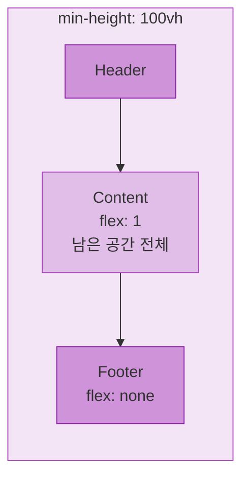

### auto margin으로 밀어내기

특정 아이템을 반대쪽 끝으로 밀어내는 테크닉이다.

```css
.toolbar {
  display: flex;
  align-items: center;
  gap: 8px;
}

.toolbar .push-right {
  margin-left: auto; /* 남은 공간을 왼쪽 margin이 흡수 → 오른쪽 끝으로 */
}
```

---

## Grid란

Grid는 **2차원 레이아웃** 시스템이다. **행과 열을 동시에** 제어할 수 있다. Flexbox가 한 방향으로 아이템을 배치한다면, Grid는 행과 열을 함께 정의하여 배치한다. 복잡한 레이아웃을 직관적으로 구현할 수 있다.

```css
.container {
  display: grid;
  grid-template-columns: 200px 1fr 200px; /* 3열 */
  grid-template-rows: 60px 1fr 40px; /* 3행 */
}
```

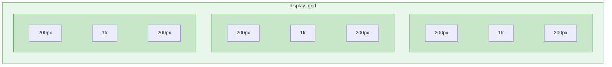

### Grid 용어

Grid를 이해하려면 몇 가지 용어를 알아야 한다.

| 용어           | 설명                                     |
| -------------- | ---------------------------------------- |
| **Grid Line**  | 행/열을 나누는 경계선, 번호가 매겨짐     |
| **Grid Track** | 두 라인 사이의 공간 = 한 행 또는 한 열   |
| **Grid Cell**  | 하나의 행과 하나의 열이 만나는 최소 단위 |
| **Grid Area**  | 하나 이상의 셀로 이루어진 직사각형 범위  |

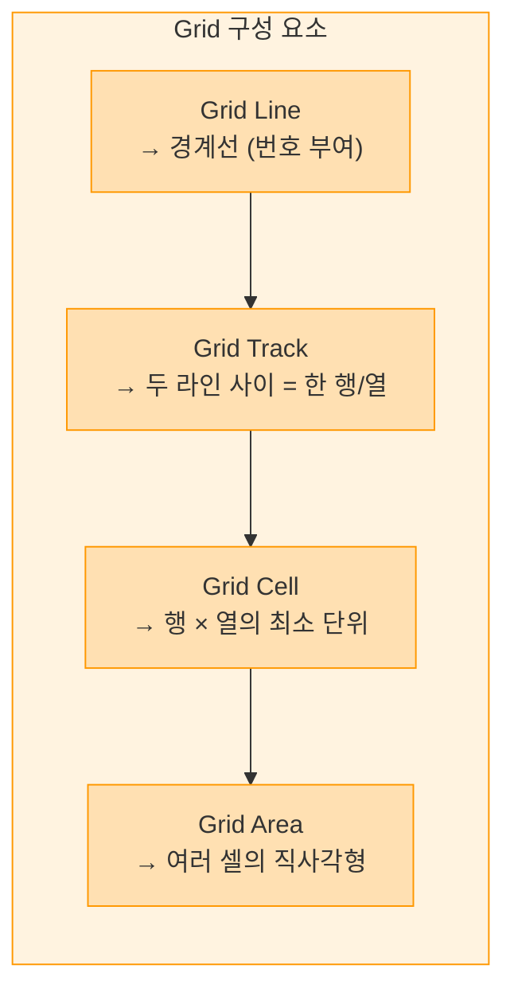

3열 그리드라면 **열 라인**은 1, 2, 3, 4번 총 4개가 생긴다. 라인은 열/행 사이사이와 양 끝에 존재한다.

## 컨테이너 속성 — Grid

| 속성                    | 설명                  | 예시              |
| ----------------------- | --------------------- | ----------------- |
| `grid-template-columns` | 열 크기 정의          | `200px 1fr 200px` |
| `grid-template-rows`    | 행 크기 정의          | `60px 1fr 40px`   |
| `grid-template-areas`   | 이름으로 영역 배치    | `"header header"` |
| `gap`                   | 셀 간격               | `16px`            |
| `justify-items`         | 셀 안 가로 정렬       | `start`           |
| `align-items`           | 셀 안 세로 정렬       | `center`          |
| `justify-content`       | 그리드 전체 가로 정렬 | `center`          |
| `align-content`         | 그리드 전체 세로 정렬 | `center`          |

### grid-template-columns / grid-template-rows

열과 행의 **크기를 정의**하는 핵심 속성이다. 다양한 단위를 혼합하여 사용할 수 있다.

```css
.container {
  display: grid;

  /* 고정 크기 */
  grid-template-columns: 200px 300px 200px;

  /* fr 단위 — 남은 공간을 비율로 분배 */
  grid-template-columns: 1fr 2fr 1fr; /* 1:2:1 비율 */

  /* 혼합 사용 */
  grid-template-columns: 250px 1fr 250px; /* 양쪽 고정, 가운데 유동 */

  /* auto — 콘텐츠 크기에 맞춤 */
  grid-template-columns: auto 1fr auto;
}
```

### fr 단위

**fraction**, 분수의 약자로 남은 공간을 **비율로 분배**한다. Flexbox의 `flex-grow`와 비슷한 개념이다.

```css
.container {
  display: grid;
  width: 900px;

  /* 1fr 1fr 1fr = 300px 300px 300px */
  grid-template-columns: 1fr 1fr 1fr;

  /* 200px 고정 + 나머지를 1:2로 분배 */
  grid-template-columns: 200px 1fr 2fr;
}
```

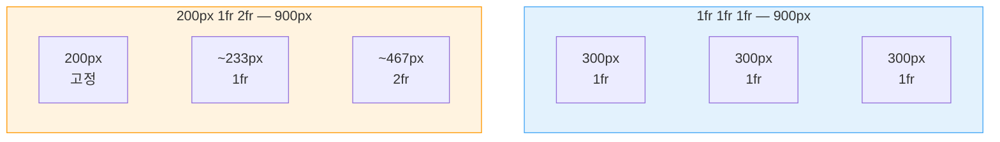

200px 고정 후 남은 700px을 1:2 비율로 분배하면 약 233px과 467px이 된다.

### repeat 함수

반복되는 트랙 패턴을 간결하게 작성한다.

```css
.container {
  /* 6열을 1fr로 반복 */
  grid-template-columns: repeat(6, 1fr);
  /* = 1fr 1fr 1fr 1fr 1fr 1fr */

  /* 패턴 반복 */
  grid-template-columns: repeat(3, 100px 1fr);
  /* = 100px 1fr 100px 1fr 100px 1fr */

  /* 반복 + 추가 열 혼합 */
  grid-template-columns: 200px repeat(4, 1fr) 200px;
  /* = 200px 1fr 1fr 1fr 1fr 200px */
}
```

### auto-fill / auto-fit

`repeat()`과 함께 사용하여 **컨테이너 크기에 따라 자동으로 열 수를 조절**한다. 반응형 레이아웃의 핵심 기법이다.

| 값          | 설명                           |
| ----------- | ------------------------------ |
| `auto-fill` | 빈 트랙도 공간을 차지하며 유지 |
| `auto-fit`  | 빈 트랙의 공간을 0으로 축소    |

```css
.container {
  display: grid;
  grid-template-columns: repeat(auto-fill, minmax(250px, 1fr));
  gap: 16px;
}
```

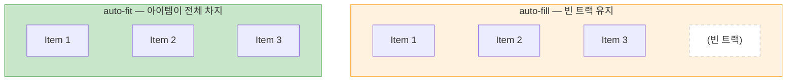

아이템이 3개이고 공간이 4열분만큼 있을 때, `auto-fill`은 빈 4번째 트랙을 유지하고, `auto-fit`은 빈 트랙을 없앤 뒤 아이템이 전체 너비를 차지한다.

### minmax 함수

트랙의 **최솟값과 최댓값**을 지정한다. 반응형 레이아웃에서 매우 유용하다.

```css
.container {
  display: grid;

  /* 최소 200px, 최대 1fr */
  grid-template-columns: minmax(200px, 1fr) 2fr;

  /* 행 높이: 최소 100px, 내용에 따라 늘어남 */
  grid-template-rows: minmax(100px, auto);

  /* 가장 많이 쓰는 반응형 패턴 */
  grid-template-columns: repeat(auto-fit, minmax(250px, 1fr));
}
```

> **반응형 카드의 정석**
>
> `repeat(auto-fit, minmax(250px, 1fr))`는 미디어 쿼리 없이 반응형 카드 레이아웃을 만드는 가장 간단한 방법이다. 최소 250px을 보장하면서 남는 공간을 균등하게 분배한다.

### grid-template-areas

**ASCII 아트처럼** 직관적으로 레이아웃을 정의한다. 각 아이템에 `grid-area` 이름을 부여하고 컨테이너에서 배치한다.

```css
.container {
  display: grid;
  grid-template-columns: 250px 1fr 250px;
  grid-template-rows: 60px 1fr 40px;
  grid-template-areas:
    'header  header  header'
    'sidebar content aside'
    'footer  footer  footer';
  gap: 16px;
}

.header {
  grid-area: header;
}
.sidebar {
  grid-area: sidebar;
}
.content {
  grid-area: content;
}
.aside {
  grid-area: aside;
}
.footer {
  grid-area: footer;
}
```

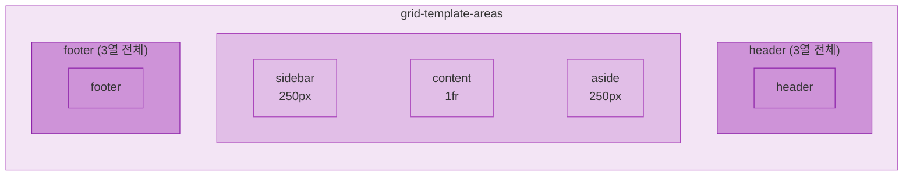

`.`을 사용하면 빈 셀로 처리할 수 있다.

```css
.container {
  grid-template-areas:
    'header header  header'
    'sidebar content    .' /* 오른쪽은 비움 */
    'footer  footer footer';
}
```

## 아이템 배치 — grid-column / grid-row

아이템이 **몇 번 라인부터 몇 번 라인까지** 차지할지 지정한다. `grid-template-areas` 대신 라인 번호로 직접 배치하는 방법이다.

```css
.item {
  /* 열 라인 1부터 3까지 (2열 차지) */
  grid-column: 1 / 3;

  /* 행 라인 1부터 2까지 (1행 차지) */
  grid-row: 1 / 2;

  /* span — 시작점에서 N칸 차지 */
  grid-column: 1 / span 2; /* 라인 1부터 2칸 = 1 / 3과 동일 */
  grid-row: span 3; /* 현재 위치에서 3행 차지 */

  /* -1은 마지막 라인 — 끝까지 차지 */
  grid-column: 1 / -1; /* 전체 열 차지 */
}
```

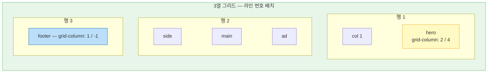

`grid-column: 1 / -1`은 첫 라인부터 마지막 라인까지, 즉 전체 열을 차지한다.

## 암시적 그리드

`grid-template`으로 정의하지 않은 **추가 행/열**이 자동으로 생길 때의 크기를 `grid-auto-rows`와 `grid-auto-columns`로 지정한다. 아이템 수가 동적일 때 유용하다.

```css
.container {
  display: grid;
  grid-template-columns: repeat(3, 1fr);
  grid-auto-rows: 150px; /* 자동 행 높이 150px */
  grid-auto-rows: minmax(100px, auto); /* 최소 100px, 내용에 따라 늘어남 */
}
```

## 셀 안 정렬

각 셀 안에서 아이템의 정렬을 결정하는 속성들이다.

| 속성            | 방향 | 설명                                    |
| --------------- | ---- | --------------------------------------- |
| `justify-items` | 가로 | 셀 안에서 아이템의 가로 정렬            |
| `align-items`   | 세로 | 셀 안에서 아이템의 세로 정렬            |
| `place-items`   | 양쪽 | 단축 속성 — `align-items justify-items` |

| 값               | 설명           |
| ---------------- | -------------- |
| `stretch` (기본) | 셀 전체를 채움 |
| `start`          | 시작점에 정렬  |
| `end`            | 끝점에 정렬    |
| `center`         | 가운데 정렬    |

```css
.container {
  display: grid;
  place-items: center; /* 모든 아이템을 셀 가운데 정렬 */
  place-items: center start; /* 세로 가운데, 가로 시작점 */
}
```

### 그리드 전체 정렬

그리드 전체가 컨테이너 안에서 어떻게 위치하는지 결정한다. 그리드 총 크기가 컨테이너보다 작을 때 효과가 있다.

```css
.container {
  display: grid;
  grid-template-columns: repeat(3, 200px); /* 총 600px */
  justify-content: center; /* 그리드 전체를 가로 가운데 */
  align-content: center; /* 그리드 전체를 세로 가운데 */
}
```

### 개별 아이템 정렬

특정 아이템만 셀 안에서 다르게 정렬하려면 `justify-self`와 `align-self`를 사용한다.

```css
.container {
  display: grid;
  place-items: stretch; /* 기본 — 모든 아이템 셀 채움 */
}

.special {
  justify-self: end; /* 이 아이템만 오른쪽 정렬 */
  align-self: center; /* 이 아이템만 세로 가운데 */
}
```

## Grid 활용 패턴

### 기본 페이지 레이아웃

Holy Grail Layout이라 불리는 전형적인 페이지 구조다.

```css
.page {
  display: grid;
  grid-template-columns: 250px 1fr 200px;
  grid-template-rows: auto 1fr auto;
  grid-template-areas:
    'header  header  header'
    'nav     main    aside'
    'footer  footer  footer';
  min-height: 100vh;
}
```

### 반응형 카드 그리드

미디어 쿼리 없이 반응형 카드 레이아웃을 만든다.

```css
.card-grid {
  display: grid;
  grid-template-columns: repeat(auto-fit, minmax(280px, 1fr));
  gap: 24px;
}
```

### 12열 그리드 시스템

```css
.grid-12 {
  display: grid;
  grid-template-columns: repeat(12, 1fr);
  gap: 16px;
}

.col-full {
  grid-column: 1 / -1;
} /* 12열 전체 */
.col-half {
  grid-column: span 6;
} /* 6열 차지 */
.col-third {
  grid-column: span 4;
} /* 4열 차지 */
.col-quarter {
  grid-column: span 3;
} /* 3열 차지 */
```

### 이미지 갤러리

다양한 크기의 아이템을 배치한다.

```css
.gallery {
  display: grid;
  grid-template-columns: repeat(4, 1fr);
  grid-auto-rows: 200px;
  gap: 8px;
}

.gallery .featured {
  grid-column: span 2;
  grid-row: span 2;
}
```

### 완벽한 가운데 정렬

Grid로 가운데 정렬하는 가장 짧은 코드다.

```css
.center {
  display: grid;
  place-items: center;
}
```

### 반응형 사이드바 레이아웃

```css
.layout {
  display: grid;
  grid-template-columns: minmax(200px, 300px) 1fr;
  gap: 24px;
}

@media (max-width: 768px) {
  .layout {
    grid-template-columns: 1fr; /* 모바일에서 1열로 */
  }
}
```

---

## Flexbox vs Grid

| 특성        | Flexbox                     | Grid                             |
| ----------- | --------------------------- | -------------------------------- |
| 차원        | **1차원** — 행 또는 열      | **2차원** — 행 + 열              |
| 접근 방식   | 콘텐츠 우선                 | 레이아웃 우선                    |
| 적합한 용도 | 한 방향 정렬, 컴포넌트 내부 | 전체 페이지 레이아웃, 2차원 배치 |
| 아이템 크기 | 콘텐츠 기반으로 유연하게    | 트랙 크기에 맞춰 배치            |
| 줄바꿈 시   | 각 줄이 독립적              | 행과 열이 정렬됨                 |

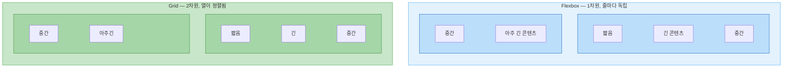

Flexbox는 콘텐츠 크기에 따라 각 줄의 열이 달라지지만, Grid는 행과 열이 항상 정렬된다.

### 언제 무엇을 쓸까

| 상황                   | 추천    |
| ---------------------- | ------- |
| 네비게이션 바          | Flexbox |
| 카드 내부 레이아웃     | Flexbox |
| 버튼 그룹, 태그 목록   | Flexbox |
| 아이템 가운데 정렬     | 둘 다   |
| 전체 페이지 레이아웃   | Grid    |
| 반응형 카드 그리드     | Grid    |
| 대시보드 레이아웃      | Grid    |
| 갤러리                 | Grid    |
| 행과 열 동시 정렬 필요 | Grid    |

> **실전 팁**
>
> Flexbox와 Grid를 배타적으로 사용할 필요 없다. **Grid로 전체 레이아웃을 잡고, 각 영역 안에서 Flexbox로 세부 배치**하는 것이 가장 일반적인 패턴이다.

### Grid + Flexbox 조합

```css
/* 전체 레이아웃: Grid */
.page {
  display: grid;
  grid-template-columns: 250px 1fr;
  grid-template-rows: 60px 1fr;
  grid-template-areas:
    'header header'
    'sidebar main';
}

/* 헤더 내부: Flexbox */
.header {
  grid-area: header;
  display: flex;
  justify-content: space-between;
  align-items: center;
}

/* 사이드바 내비: Flexbox */
.sidebar nav {
  display: flex;
  flex-direction: column;
  gap: 4px;
}

/* 메인 콘텐츠의 카드 그리드: Grid */
.main .card-grid {
  display: grid;
  grid-template-columns: repeat(auto-fit, minmax(250px, 1fr));
  gap: 16px;
}
```

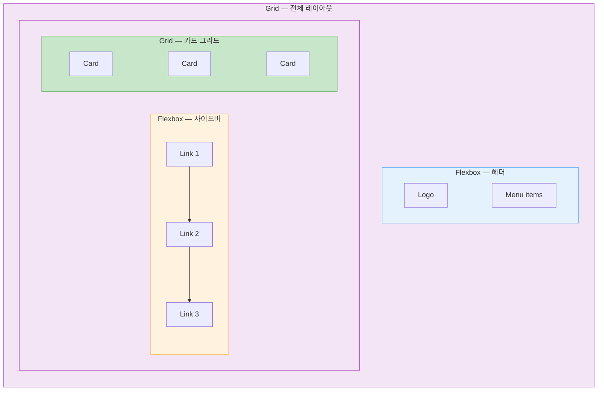

Grid로 전체 구조를 잡고, 헤더와 사이드바 내부는 Flexbox로, 카드 영역은 다시 Grid로 배치한다. 이처럼 두 시스템을 적재적소에 조합하는 것이 실전에서 가장 효과적이다.
