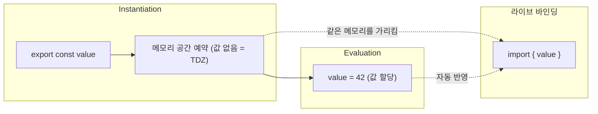

> 이 글은 주니어 개발자가 학습하며 정리한 내용입니다. 잘못된 정보가 있을 수 있으니, 발견하시면 편하게 알려주세요.

## 모듈이란?

모듈이란 특정한 기능을 하는 독립적인 코드 단위를 말한다. 예를 들어 하나의 파일에 사용자 인증, 데이터 저장, 알림 전송 로직이 모두 섞여 있다면 코드를 파악하기도, 수정하기도 어렵다. 이를 각각 `auth.js`, `db.js`, `notification.js`로 분리하면 각 파일은 하나의 책임만 가지게 된다. 다른 곳에서 인증 기능이 필요하면 `auth.js`를 가져다 쓰면 되므로 재사용성이 높아지고, 알림 로직에 버그가 생기면 `notification.js`만 열어보면 되므로 관리가 용이해진다.

```js
// auth.js — 인증 모듈
export function login(user) {
  /* ... */
}

// db.js — 데이터 저장 모듈
export function save(data) {
  /* ... */
}

// app.js — 필요한 모듈만 가져와서 사용
import { login } from './auth.js'
import { save } from './db.js'
```

## 자바스크립트의 모듈 시스템

자바스크립트에는 다양한 모듈 시스템이 존재한다. 초기 자바스크립트에는 모듈 개념이 없었기 때문에 커뮤니티와 런타임 환경에서 각자의 방식으로 모듈 시스템을 만들어 왔다. 대표적으로 Node.js의 **CommonJS(CJS)**, 브라우저 표준인 **ESM(ECMAScript Modules)**, 그 외에 AMD, UMD 등이 있다. AMD와 UMD는 현재 거의 사용되지 않으므로 이 글에서는 CJS와 ESM을 중심으로 다룬다.

## CJS (CommonJS)

Node.js가 채택한 모듈 시스템으로, `require()`로 모듈을 가져오고 `module.exports`로 내보낸다. Node.js 환경에서 별도 설정 없이 기본으로 동작한다.

```js
// math.js — 모듈 내보내기
function add(a, b) {
  return a + b
}

function multiply(a, b) {
  return a * b
}

module.exports = { add, multiply }
```

```js
// app.js — 모듈 가져오기
const { add, multiply } = require('./math')

console.log(add(2, 3)) // 5
console.log(multiply(4, 5)) // 20
```

CJS에서 각 파일은 실행 시 Node.js가 자동으로 제공하는 `module` 객체를 갖는다. 이 객체에는 모듈의 ID, 파일 경로, 부모·자식 관계 등의 정보가 담겨 있고, `module.exports` 속성에 값을 할당하면 그것이 외부로 내보내지는 모듈의 공개 인터페이스가 된다.

```js
// module 객체의 주요 속성
console.log(module.id) // 모듈 식별자 (메인 파일이면 '.')
console.log(module.filename) // 파일의 절대 경로
console.log(module.loaded) // 로딩 완료 여부
console.log(module.parent) // 이 모듈을 require한 부모 모듈
console.log(module.children) // 이 모듈이 require한 자식 모듈 목록
console.log(module.exports) // 외부에 내보내는 값
```

### require()의 5단계 동작 과정

`require('./math')`를 호출하면 Node.js는 다음 5단계를 순서대로 수행한다.

**1. Resolution (경로 해석)**\
`'./math'`라는 문자열을 실제 파일 경로로 변환한다. 상대 경로면 호출한 파일 기준으로, 패키지 이름이면 `node_modules`를 탐색한다. 확장자가 없으면 `.js` → `.json` → `.node` 순서로 시도한다.

```js
console.log(require.resolve.paths('express'))
// [ '/Users/novel/project/node_modules',
//   '/Users/novel/node_modules',
//   '/Users/node_modules',
//   '/node_modules' ]
```

**2. Loading (파일 읽기)**\
해석된 경로에서 파일 내용을 읽어온다. `.js`면 텍스트로, `.json`이면 `JSON.parse()`로, `.node`면 바이너리 애드온으로 로드한다.

**3. Wrapping (함수 래핑)**\
읽어온 코드를 아래와 같은 함수로 감싼다. 이 덕분에 각 모듈은 자신만의 스코프를 갖게 되고, `module`, `exports`, `require`, `__filename`, `__dirname`을 사용할 수 있다.

```js
;(function (exports, require, module, __filename, __dirname) {
  // 모듈 코드가 여기에 들어간다
})
```

**4. Evaluation (실행)**\
래핑된 함수를 실행한다. 이 과정에서 모듈 내부 코드가 동작하고, `module.exports`에 값이 할당된다.

**5. Caching (캐싱)**\
실행 결과를 캐시에 저장한다. 같은 모듈을 다시 `require()`하면 파일을 다시 읽지 않고 캐시된 `module.exports`를 즉시 반환한다.

```js
require('./math')
console.log(require.cache)
// { '/absolute/path/math.js': Module { exports: { add: [Function], multiply: [Function] }, ... } }
```

`require()`는 이 과정을 동기적으로 수행하기 때문에 조건에 따라 모듈을 불러오는 것도 가능하다.

```js
// 조건부 로딩이 가능하다
if (process.env.NODE_ENV === 'production') {
  const logger = require('./prodLogger')
}
```

## ESM (ECMAScript Modules)

JavaScript 공식 표준 모듈 시스템으로, `import`/`export` 키워드를 사용한다. 브라우저와 Node.js 모두 지원한다.

```js
// math.js — 모듈 내보내기
export function add(a, b) {
  return a + b
}

export function multiply(a, b) {
  return a * b
}

// default export도 가능
export default function subtract(a, b) {
  return a - b
}
```

```js
// app.js — 모듈 가져오기
import subtract, { add, multiply } from './math.js'

console.log(add(2, 3)) // 5
console.log(subtract(10, 4)) // 6
```

### ESM의 모듈 로딩 과정

ESM은 CJS와 달리 비동기적으로 모듈을 로딩하며, 다음 5단계를 거친다.

**1. Entry (진입)**\
시작점이 되는 모듈 파일을 결정한다. `node app.js`를 실행하면 `app.js`가 진입점이 되고, 여기서부터 `import` 문을 따라가며 모듈 그래프를 구성한다.

**2. Loading (로딩)**\
진입점에서 출발해 `import` 문에 명시된 경로를 따라 필요한 파일들을 모두 찾아 다운로드(또는 읽기)한다. 브라우저에서는 네트워크 요청, Node.js에서는 파일 시스템 읽기로 수행된다.

**3. Parsing (파싱)**\
로드된 소스 코드를 파싱해서 `import`와 `export` 문을 정적으로 분석한다. 코드를 실행하지 않고도 어떤 모듈이 어떤 값을 내보내고 가져오는지 파악할 수 있다. 이 정적 분석 덕분에 **Tree-shaking**이 가능하다. 파싱이 완료되면 각 모듈마다 **Module Record**가 생성되는데, 여기에는 해당 모듈의 소스 코드, import/export 목록, 의존하는 다른 모듈의 정보 등이 담겨 있다.

**4. Instantiation (인스턴스화)**\
Module Record를 기반으로 의존성 그래프를 **DFS**(깊이 우선 탐색)로 순회하며, 각 모듈의 export 변수에 대해 메모리 공간을 예약한다. 이 단계에서 **라이브 바인딩**이 설정되어 import와 export가 같은 메모리 위치를 가리키게 된다. 단, 아직 코드는 실행되지 않았으므로 값은 채워지지 않은 상태다. 이 "공간은 확보됐지만 값은 없는" 상태가 바로 **TDZ**(Temporal Dead Zone)이다.

```js
// 호이스팅은 되지만 TDZ에 의해 접근 불가
console.log(value) // ReferenceError: Cannot access 'value' before initialization
export const value = 42 // Evaluation 단계에서 비로소 값이 할당된다
```



**5. Evaluation (실행)**\
모든 연결이 완료된 후 코드를 실행해 실제 값을 채운다. 의존성 그래프의 가장 깊은 모듈부터 실행되며, 각 모듈은 한 번만 실행된다.


CJS가 파일을 하나씩 순서대로 읽고 즉시 실행하는 것과 달리, ESM은 먼저 전체 의존성 그래프를 파악한 뒤 한꺼번에 실행한다.

### import 값의 불변성

CJS에서 `require()`는 export된 값의 **복사본**을 가져오지만, ESM에서 `import`는 원본에 대한 **읽기 전용 바인딩**을 가져온다. 따라서 import한 값을 직접 재할당할 수 없다.

```js
// counter.js
export let count = 0
export function increment() {
  count++
}
```

```js
// app.js
import { count, increment } from './counter.js'

console.log(count) // 0
increment()
console.log(count) // 1 — 원본이 변경되면 반영된다 (라이브 바인딩)

count = 10 // TypeError: Assignment to constant variable.
// import한 값은 읽기 전용이므로 직접 재할당할 수 없다
```

### Node.js에서 ESM 사용하기

Node.js에서 ESM을 사용하는 방법은 두 가지다.

**1. 파일 확장자를 `.mjs`로 사용**\
별도 설정 없이 해당 파일을 ESM으로 인식한다.

```plaintext
project/
├── package.json
├── app.mjs        ← ESM
└── utils.js       ← CJS (기본)
```

**2. package.json에 `"type": "module"` 설정**\
프로젝트의 모든 `.js` 파일을 ESM으로 인식한다. CJS가 필요한 파일은 `.cjs` 확장자를 사용하면 된다.

```json
{
  "name": "my-project",
  "type": "module"
}
```

```plaintext
project/
├── package.json   ← "type": "module"
├── app.js         ← ESM으로 해석됨
├── utils.js       ← ESM으로 해석됨
└── legacy.cjs     ← CJS로 강제
```

프로젝트 전체를 ESM으로 통일하려면 `"type": "module"` 설정이 편하고, 기존 CJS 프로젝트에서 일부 파일만 ESM으로 쓰고 싶으면 `.mjs` 확장자를 사용하면 된다.

## CJS와 ESM 간의 상호 운용

실무에서는 CJS 패키지와 ESM 패키지가 혼재하기 때문에 서로 다른 모듈 시스템 간의 import/export를 이해해야 한다.

### ESM에서 CJS 가져오기

ESM 파일에서 CJS 모듈을 `import`로 가져올 수 있다. 단, CJS의 `module.exports` 전체가 default import로 들어온다.

```js
// legacy.cjs (CJS)
module.exports = {
  greet: (name) => `Hello, ${name}`,
  farewell: (name) => `Bye, ${name}`,
}
```

```js
// app.mjs (ESM)
import legacy from './legacy.cjs'

legacy.greet('novel') // 'Hello, novel'
legacy.farewell('novel') // 'Bye, novel'

// named import는 동작하지 않을 수 있다
// import { greet } from './legacy.cjs'; // 환경에 따라 에러
```

### CJS에서 ESM 가져오기

CJS에서 ESM 모듈을 `require()`로 가져올 수 없다. ESM은 비동기로 로딩되기 때문이다. 대신 `await import()`(dynamic import)를 사용해야 한다.

```js
// utils.mjs (ESM)
export function double(n) {
  return n * 2
}
```

```js
// app.cjs (CJS)

// require()는 불가능
// const { double } = require('./utils.mjs'); // ERR_REQUIRE_ESM

// dynamic import로 가져와야 한다 (비동기)
async function main() {
  const { double } = await import('./utils.mjs')
  console.log(double(5)) // 10
}
main()
```

### 상호 운용 요약

| 방향      | 방법             | 비고                                       |
| --------- | ---------------- | ------------------------------------------ |
| ESM → CJS | `import`         | `module.exports`가 default로 들어옴        |
| CJS → ESM | `await import()` | 동기 `require()` 불가, async 컨텍스트 필요 |

CJS와 ESM이 섞인 프로젝트에서는 이 비대칭성 때문에 문제가 생기기 쉽다. 가능하면 프로젝트 전체를 하나의 모듈 시스템으로 통일하는 것이 좋다.
