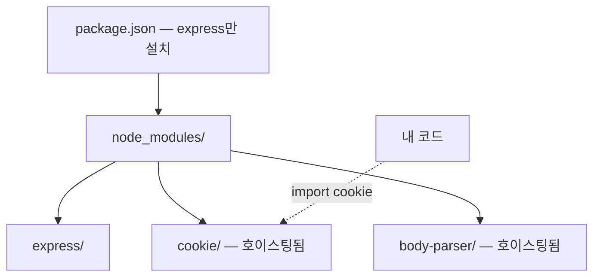
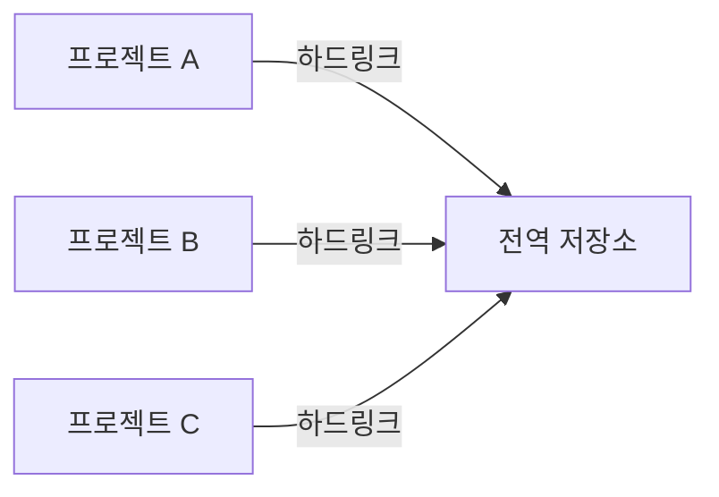

> 이 글은 주니어 개발자가 학습하며 정리한 내용입니다. 잘못된 정보가 있을 수 있으니, 발견하시면 편하게 알려주세요.

## npm의 node_modules 문제

pnpm이 왜 필요한지 이해하려면 npm의 node_modules 구조가 가진 문제를 먼저 알아야 한다.

### 초기 npm — 중첩 구조

npm 초기 버전(v1~v2)은 의존성을 그대로 중첩해서 설치했다. express가 cookie를 의존하고, cookie가 다시 다른 패키지를 의존하면 디렉토리가 한없이 깊어진다.

```plaintext
node_modules/
├── express/
│   └── node_modules/
│       ├── cookie/
│       ├── body-parser/
│       │   └── node_modules/
│       │       ├── bytes/
│       │       ├── content-type/
│       │       └── raw-body/
│       │           └── node_modules/
│       │               └── unpipe/
│       └── accepts/
│           └── node_modules/
│               ├── mime-types/
│               │   └── node_modules/
│               │       └── mime-db/
│               └── negotiator/
└── msw/
    └── node_modules/
        ├── cookie/          ← express와 동일한 패키지가 중복 설치
        └── headers-polyfill/
```

같은 패키지가 여러 곳에 중복 설치되어 디스크를 낭비한다.

### npm v3 이후 — 평탄(flat) 구조

npm v3부터는 호이스팅(hoisting)을 도입해 가능한 한 모든 패키지를 node_modules 최상위에 펼쳐놓는다.

```plaintext
node_modules/
├── express/
├── cookie/        ← express의 내부 의존성이 최상위에 올라옴
├── body-parser/
└── ...
```

중복 설치와 경로 깊이 문제는 해결됐지만, 새로운 문제가 생겼다.

### 유령 의존성 (Phantom Dependency)

평탄 구조에서는 직접 설치하지 않은 패키지도 node_modules 최상위에 올라오기 때문에, 코드에서 아무 제약 없이 가져다 쓸 수 있다.

```js
// package.json에 express만 설치했는데
// express의 내부 의존성인 cookie를 직접 import할 수 있다
import cookie from 'cookie' // 정상 동작 !
```

`cookie`는 `express`의 내부 의존성일 뿐, 내 프로젝트가 직접 의존하는 패키지가 아니다. 만약 express가 다음 버전에서 cookie를 제거하거나 다른 패키지로 교체하면, 내 코드는 아무 경고 없이 깨진다.



pnpm은 이 문제를 구조적으로 해결한다.

## Content-Addressable Store

pnpm의 핵심은 **전역 저장소**(Content-Addressable Store)다. 모든 패키지 파일은 사용자 홈 디렉토리의 전역 저장소에 **딱 한 번만** 저장된다.

```bash
# 저장소 위치 확인
pnpm store path
# macOS: ~/Library/pnpm/store/v3
# Linux: ~/.local/share/pnpm/store/v3
```

저장소 내부를 보면 패키지 파일들이 **내용의 해시값**을 기반으로 저장되어 있다.

```plaintext
~/Library/pnpm/store/v3/files/
├── 0c/   ← 해시값으로 구분된 디렉토리
├── 19/
├── a3/
└── ...
```

"Content-Addressable"란 파일의 **내용**(content)이 곧 **주소**(address)가 된다는 의미다. 동일한 내용의 파일은 해시값이 같으므로 절대 중복 저장되지 않는다. 10개 프로젝트에서 `react@18.2.0`을 사용하더라도 전역 저장소에는 한 벌만 존재한다.

npm은 프로젝트마다 패키지를 복사해서 설치하므로 3개 프로젝트에 React를 설치하면 135MB(45MB x 3)를 차지한다. pnpm은 전역 저장소의 한 벌을 하드링크로 공유하므로 45MB만 사용한다.



## pnpm의 node_modules 구조

pnpm이 패키지를 설치하면 node_modules는 다음과 같은 3단 구조를 갖는다.

```plaintext
node_modules/
├── .pnpm/                              ← Virtual Store
│   ├── express@4.18.2/
│   │   └── node_modules/
│   │       ├── express/                ← 전역 저장소의 하드링크
│   │       ├── cookie/                 ← express가 의존하는 패키지
│   │       └── body-parser/
│   ├── cookie@0.5.0/
│   │   └── node_modules/
│   │       └── cookie/                 ← 전역 저장소의 하드링크
│   └── react@18.2.0/
│       └── node_modules/
│           └── react/                  ← 전역 저장소의 하드링크
├── express → .pnpm/express@4.18.2/node_modules/express   ← 심볼릭 링크
└── react → .pnpm/react@18.2.0/node_modules/react         ← 심볼릭 링크
```

세 가지 저장 위치가 각각의 역할을 한다.

**1. Content-Addressable Store** (전역 저장소)\
패키지 파일의 원본이 저장되는 곳이다. 모든 프로젝트가 이 저장소를 공유한다.

**2. Virtual Store** (`node_modules/.pnpm`)\
전역 저장소의 파일을 **하드링크**로 참조하는 곳이다. 하드링크는 파일의 복사본이 아니라 같은 디스크 블록을 가리키는 포인터이므로 추가 용량을 차지하지 않는다. 각 패키지 버전별로 디렉토리가 생기며, 해당 패키지의 의존성도 함께 배치된다.

**3. node_modules 최상위** (심볼릭 링크)\
`package.json`에 명시된 의존성만 심볼릭 링크로 노출된다. express를 설치했으면 `node_modules/express`만 보이고, express의 내부 의존성인 cookie는 최상위에 나타나지 않는다.

이 구조 덕분에 유령 의존성 문제가 원천 차단된다. `package.json`에 직접 명시하지 않은 패키지는 node_modules 최상위에 존재하지 않으므로 import할 수 없다.

```js
import cookie from 'cookie' // Error: Module not found
// cookie는 node_modules 최상위에 없으므로 접근할 수 없다
```

## 하드링크와 심볼릭 링크

pnpm의 구조를 이해하려면 두 가지 링크의 차이를 알아야 한다.

### 하드링크 (Hard Link)

같은 파일 데이터(inode)를 가리키는 또 다른 이름이다. 원본과 하드링크는 완전히 동등하며, 하나를 수정하면 다른 쪽에도 반영된다. 복사와 달리 추가 디스크 공간을 소비하지 않는다.

pnpm은 전역 저장소의 파일을 Virtual Store에 하드링크로 연결한다.

### 심볼릭 링크 (Symbolic Link)

다른 파일이나 디렉토리의 **경로**를 가리키는 바로가기다. 원본이 삭제되면 심볼릭 링크는 깨진다(dangling link). pnpm은 Virtual Store의 패키지를 node_modules 최상위에 심볼릭 링크로 노출한다.

두 링크를 함께 사용하는 이유가 있다. 하드링크는 디스크 공간을 절약하기 위해 전역 저장소와 Virtual Store를 연결하고, 심볼릭 링크는 `package.json`에 명시된 패키지만 선택적으로 노출하기 위해 Virtual Store와 node_modules 최상위를 연결한다.


## npm, yarn, pnpm 비교

| 측면              | npm               | yarn                         | pnpm                   |
| ----------------- | ----------------- | ---------------------------- | ---------------------- |
| 저장 방식         | 프로젝트마다 복사 | 프로젝트마다 복사 (PnP 제외) | 전역 저장소 + 하드링크 |
| 디스크 사용량     | 높음              | 높음                         | 낮음                   |
| 설치 속도         | 보통              | 빠름                         | 매우 빠름              |
| 유령 의존성       | 허용              | 허용 (PnP 제외)              | 차단                   |
| 모노레포 지원     | npm workspaces    | yarn workspaces              | pnpm workspaces        |
| node_modules 구조 | 평탄 (hoisting)   | 평탄 (PnP는 없음)            | 심볼릭 링크 기반       |

세 패키지 매니저 모두 동일한 npm 레지스트리를 사용하므로 설치할 수 있는 패키지에는 차이가 없다. 차이는 패키지를 **저장하고 연결하는 방식**에 있으며, pnpm은 Content-Addressable Store와 심볼릭 링크 기반 구조를 통해 디스크 효율성과 의존성 안전성을 동시에 확보한다.
